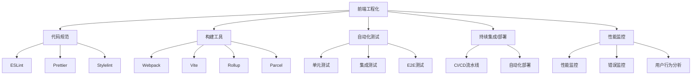
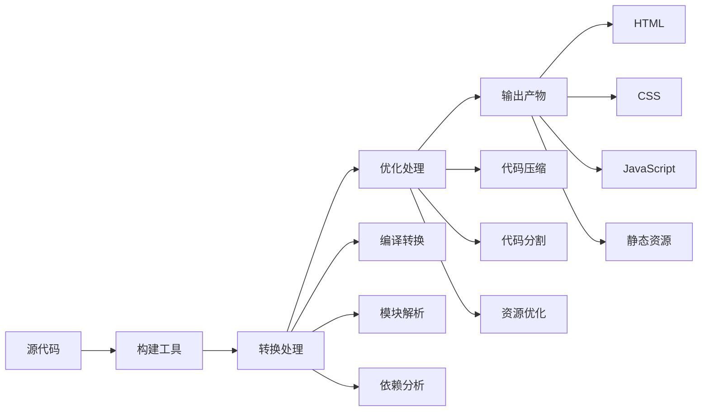

# 前端工程化基础与构建工具

## 前端工程化概述

### 什么是前端工程化

前端工程化是指通过工具和流程来规范化、自动化前端开发过程，提高开发效率、代码质量和可维护性的实践。它涵盖了从项目初始化、开发、测试到部署的整个生命周期。

### 前端工程化的核心价值

1. **提高开发效率**：通过自动化工具减少重复性工作
2. **保证代码质量**：通过规范和检查工具确保代码一致性
3. **优化项目性能**：通过构建工具优化资源加载和执行
4. **简化部署流程**：通过自动化部署减少人为错误
5. **增强团队协作**：通过统一的规范和工具提高协作效率

### 前端工程化的主要组成部分



## 构建工具基础

### 为什么需要构建工具

现代前端开发面临以下挑战：

1. **模块化开发**：ES6模块、CommonJS、AMD等模块系统需要转换
2. **语言转换**：TypeScript、JSX、Sass/Less等需要编译为浏览器可执行代码
3. **资源优化**：压缩、合并、拆分代码以减少网络请求
4. **兼容性处理**：处理不同浏览器间的API差异
5. **开发体验**：热更新、错误提示、源码映射等

### 构建工具的工作流程



## Webpack详解

### Webpack核心概念

#### 1. 入口(Entry)

入口点是Webpack开始构建的起点，Webpack会从这个文件开始递归查找所有依赖。

```javascript
// webpack.config.js
module.exports = {
  entry: './src/index.js', // 单入口
  // 或者
  entry: {
    app: './src/app.js',
    vendor: './src/vendor.js'
  } // 多入口
};
```

#### 2. 输出(Output)

输出配置告诉Webpack如何将编译后的文件输出到磁盘。

```javascript
const path = require('path');

module.exports = {
  entry: './src/index.js',
  output: {
    path: path.resolve(__dirname, 'dist'),
    filename: '[name].[contenthash].js', // 使用内容哈希实现长期缓存
    clean: true, // 清理输出目录
    publicPath: '/' // 公共路径
  }
};
```

#### 3. 加载器(Loader)

Loader让Webpack能够处理非JavaScript文件。

```javascript
module.exports = {
  module: {
    rules: [
      {
        test: /\.css$/i,
        use: ['style-loader', 'css-loader']
      },
      {
        test: /\.(png|jpe?g|gif)$/i,
        type: 'asset/resource',
        generator: {
          filename: 'images/[hash][ext][query]'
        }
      },
      {
        test: /\.tsx?$/,
        use: 'ts-loader',
        exclude: /node_modules/
      }
    ]
  }
};
```

#### 4. 插件(Plugin)

插件用于执行范围更广的任务，从打包优化到环境变量定义。

```javascript
const HtmlWebpackPlugin = require('html-webpack-plugin');
const MiniCssExtractPlugin = require('mini-css-extract-plugin');

module.exports = {
  plugins: [
    new HtmlWebpackPlugin({
      template: './src/index.html',
      filename: 'index.html',
      inject: 'body'
    }),
    new MiniCssExtractPlugin({
      filename: 'styles/[name].[contenthash].css'
    })
  ]
};
```

#### 5. 模式(Mode)

模式可以是`development`、`production`或`none`，每个模式都有预设的优化配置。

```javascript
module.exports = {
  mode: 'production' // 或 'development'
};
```

### Webpack性能优化

#### 1. 代码分割

```javascript
module.exports = {
  optimization: {
    splitChunks: {
      chunks: 'all',
      cacheGroups: {
        vendor: {
          test: /[\\/]node_modules[\\/]/,
          name: 'vendors',
          chunks: 'all'
        },
        common: {
          name: 'common',
          minChunks: 2,
          chunks: 'all',
          enforce: true
        }
      }
    }
  }
};
```

#### 2. 懒加载

```javascript
// 路由级别的懒加载
const Home = () => import('./views/Home.vue');
const About = () => import('./views/About.vue');

// 组件级别的懒加载
const LazyComponent = () => import('./components/LazyComponent.vue');
```

#### 3. Tree Shaking

```javascript
// webpack.config.js
module.exports = {
  optimization: {
    usedExports: true,
    sideEffects: false
  }
};

// package.json
{
  "sideEffects": [
    "*.css",
    "*.scss",
    "./src/style.js"
  ]
}
```

### Webpack实战配置

```javascript
// webpack.config.js
const path = require('path');
const HtmlWebpackPlugin = require('html-webpack-plugin');
const MiniCssExtractPlugin = require('mini-css-extract-plugin');
const { CleanWebpackPlugin } = require('clean-webpack-plugin');
const TerserPlugin = require('terser-webpack-plugin');
const CssMinimizerPlugin = require('css-minimizer-webpack-plugin');

module.exports = (env, argv) => {
  const isProduction = argv.mode === 'production';

  return {
    entry: {
      main: './src/index.js'
    },
    output: {
      path: path.resolve(__dirname, 'dist'),
      filename: isProduction ? '[name].[contenthash].js' : '[name].js',
      chunkFilename: isProduction ? '[name].[contenthash].chunk.js' : '[name].chunk.js',
      publicPath: '/',
      clean: true
    },
    module: {
      rules: [
        {
          test: /\.js$/,
          exclude: /node_modules/,
          use: {
            loader: 'babel-loader',
            options: {
              presets: ['@babel/preset-env']
            }
          }
        },
        {
          test: /\.css$/,
          use: [
            isProduction ? MiniCssExtractPlugin.loader : 'style-loader',
            'css-loader',
            'postcss-loader'
          ]
        },
        {
          test: /\.(png|jpe?g|gif|svg)$/i,
          type: 'asset',
          parser: {
            dataUrlCondition: {
              maxSize: 8 * 1024 // 8kb
            }
          },
          generator: {
            filename: 'images/[hash][ext][query]'
          }
        },
        {
          test: /\.(woff|woff2|eot|ttf|otf)$/i,
          type: 'asset/resource',
          generator: {
            filename: 'fonts/[hash][ext][query]'
          }
        }
      ]
    },
    plugins: [
      new CleanWebpackPlugin(),
      new HtmlWebpackPlugin({
        template: './public/index.html',
        minify: isProduction ? {
          removeComments: true,
          collapseWhitespace: true,
          removeRedundantAttributes: true,
          useShortDoctype: true,
          removeEmptyAttributes: true,
          removeStyleLinkTypeAttributes: true,
          keepClosingSlash: true,
          minifyJS: true,
          minifyCSS: true,
          minifyURLs: true
        } : false
      }),
      ...(isProduction ? [
        new MiniCssExtractPlugin({
          filename: 'styles/[name].[contenthash].css',
          chunkFilename: 'styles/[name].[contenthash].chunk.css'
        })
      ] : [])
    ],
    optimization: {
      minimize: isProduction,
      minimizer: [
        new TerserPlugin({
          parallel: true,
          terserOptions: {
            compress: {
              drop_console: isProduction
            }
          }
        }),
        new CssMinimizerPlugin()
      ],
      splitChunks: {
        chunks: 'all',
        cacheGroups: {
          vendor: {
            test: /[\\/]node_modules[\\/]/,
            name: 'vendors',
            chunks: 'all'
          }
        }
      },
      runtimeChunk: {
        name: 'runtime'
      }
    },
    devtool: isProduction ? 'source-map' : 'eval-cheap-module-source-map',
    devServer: {
      contentBase: path.join(__dirname, 'dist'),
      compress: true,
      port: 3000,
      hot: true,
      historyApiFallback: true
    },
    resolve: {
      extensions: ['.js', '.json'],
      alias: {
        '@': path.resolve(__dirname, 'src')
      }
    }
  };
};
```

## Vite详解

### Vite简介

Vite是一个由Vue.js作者尤雨溪开发的新一代前端构建工具，具有以下特点：

1. **极速的开发服务器启动**：利用ESM原生模块系统，无需打包
2. **即时的热模块更新**：基于ESM的HMR，更新速度不受项目大小影响
3. **优化的生产构建**：基于Rollup打包，代码分割更高效
4. **丰富的插件生态**：兼容Rollup插件，提供官方插件

### Vite与Webpack对比

| 特性 | Vite | Webpack |
|------|------|--------|
| 开发服务器启动速度 | 极快 | 较慢 |
| 热更新速度 | 极快 | 较慢 |
| 配置复杂度 | 简单 | 复杂 |
| 生产构建性能 | 高 | 高 |
| 插件生态 | 发展中 | 成熟 |
| 浏览器支持 | 需要原生ESM支持 | 兼容性好 |

### Vite配置

```javascript
// vite.config.js
import { defineConfig } from 'vite';
import vue from '@vitejs/plugin-vue';
import { resolve } from 'path';

export default defineConfig({
  plugins: [vue()],
  resolve: {
    alias: {
      '@': resolve(__dirname, 'src')
    }
  },
  server: {
    port: 3000,
    open: true,
    cors: true,
    proxy: {
      '/api': {
        target: 'http://localhost:8080',
        changeOrigin: true,
        rewrite: (path) => path.replace(/^\/api/, '')
      }
    }
  },
  build: {
    target: 'es2015',
    outDir: 'dist',
    assetsDir: 'assets',
    minify: 'terser',
    terserOptions: {
      compress: {
        drop_console: true,
        drop_debugger: true
      }
    },
    rollupOptions: {
      output: {
        chunkFileNames: 'js/[name]-[hash].js',
        entryFileNames: 'js/[name]-[hash].js',
        assetFileNames: '[ext]/[name]-[hash].[ext]',
        manualChunks: {
          vendor: ['vue', 'vue-router', 'vuex'],
          elementUI: ['element-plus']
        }
      }
    },
    chunkSizeWarningLimit: 1500
  },
  css: {
    preprocessorOptions: {
      scss: {
        additionalData: `@import "@/styles/variables.scss";`
      }
    }
  }
});
```

### Vite插件开发

```javascript
// vite-plugin-example.js
export function examplePlugin(options = {}) {
  return {
    name: 'vite-plugin-example',
    
    // 钩子函数
    config(config, { command }) {
      // 修改Vite配置
      console.log('当前命令:', command);
      return config;
    },
    
    configResolved(resolvedConfig) {
      // 配置解析完成
      console.log('配置已解析');
    },
    
    configureServer(server) {
      // 配置开发服务器
      server.middlewares.use((req, res, next) => {
        if (req.url === '/api/custom') {
          res.end('Custom API response');
          return;
        }
        next();
      });
    },
    
    transform(code, id) {
      // 转换代码
      if (id.endsWith('.example')) {
        return `export default ${JSON.stringify(code)}`;
      }
    },
    
    buildStart() {
      // 构建开始
      console.log('构建开始');
    },
    
    buildEnd() {
      // 构建结束
      console.log('构建结束');
    }
  };
}

// 使用插件
// vite.config.js
import { examplePlugin } from './vite-plugin-example';

export default {
  plugins: [
    examplePlugin({
      // 插件选项
    })
  ]
};
```

## 其他构建工具

### Rollup

Rollup是一个专注于ES6模块打包的工具，适合库的开发。

```javascript
// rollup.config.js
import { nodeResolve } from '@rollup/plugin-node-resolve';
import commonjs from '@rollup/plugin-commonjs';
import typescript from '@rollup/plugin-typescript';
import { terser } from 'rollup-plugin-terser';

export default [
  // UMD构建
  {
    input: 'src/index.ts',
    output: {
      file: 'dist/bundle.umd.js',
      format: 'umd',
      name: 'MyLibrary'
    },
    plugins: [
      nodeResolve(),
      commonjs(),
      typescript(),
      terser()
    ]
  },
  // ES模块构建
  {
    input: 'src/index.ts',
    output: {
      file: 'dist/bundle.esm.js',
      format: 'es'
    },
    plugins: [
      nodeResolve(),
      commonjs(),
      typescript(),
      terser()
    ]
  }
];
```

### Parcel

Parcel是一个零配置的Web应用打包工具。

```json
// package.json
{
  "scripts": {
    "dev": "parcel src/index.html",
    "build": "parcel build src/index.html"
  }
}
```

## 构建工具选择指南

### 根据项目类型选择

1. **大型企业应用**：Webpack（成熟生态，强大配置）
2. **现代前端项目**：Vite（快速开发体验）
3. **组件库开发**：Rollup（专注于ES模块）
4. **快速原型开发**：Parcel（零配置）

### 性能考虑

1. **开发环境**：Vite > Parcel > Webpack
2. **生产构建**：Webpack ≈ Rollup > Vite ≈ Parcel
3. **大型项目**：Webpack > Vite > Rollup > Parcel

## 实际应用案例

### 电商平台前端构建优化

以下是一个电商平台的前端构建优化方案：

```javascript
// webpack.config.js
const path = require('path');
const HtmlWebpackPlugin = require('html-webpack-plugin');
const MiniCssExtractPlugin = require('mini-css-extract-plugin');
const { BundleAnalyzerPlugin } = require('webpack-bundle-analyzer');

module.exports = {
  entry: {
    main: './src/main.js',
    vendor: ['vue', 'vue-router', 'vuex', 'axios', 'element-plus']
  },
  output: {
    path: path.resolve(__dirname, 'dist'),
    filename: '[name].[contenthash:8].js',
    chunkFilename: '[name].[contenthash:8].chunk.js',
    publicPath: '/'
  },
  module: {
    rules: [
      {
        test: /\.vue$/,
        loader: 'vue-loader'
      },
      {
        test: /\.js$/,
        exclude: /node_modules/,
        use: {
          loader: 'babel-loader',
          options: {
            presets: ['@babel/preset-env'],
            plugins: ['@babel/plugin-syntax-dynamic-import']
          }
        }
      },
      {
        test: /\.scss$/,
        use: [
          process.env.NODE_ENV === 'production' 
            ? MiniCssExtractPlugin.loader 
            : 'vue-style-loader',
          'css-loader',
          {
            loader: 'sass-loader',
            options: {
              additionalData: `@import "@/styles/variables.scss";`
            }
          }
        ]
      },
      {
        test: /\.(png|jpe?g|gif|webp)$/,
        type: 'asset/resource',
        generator: {
          filename: 'images/[name].[hash:8][ext]'
        }
      }
    ]
  },
  plugins: [
    new HtmlWebpackPlugin({
      template: './public/index.html',
      minify: {
        removeComments: true,
        collapseWhitespace: true,
        removeAttributeQuotes: true
      }
    }),
    new MiniCssExtractPlugin({
      filename: 'styles/[name].[contenthash:8].css',
      chunkFilename: 'styles/[name].[contenthash:8].css'
    }),
    new BundleAnalyzerPlugin({
      analyzerMode: 'static',
      openAnalyzer: false
    })
  ],
  optimization: {
    runtimeChunk: 'single',
    splitChunks: {
      chunks: 'all',
      maxInitialRequests: Infinity,
      minSize: 20000,
      cacheGroups: {
        vendor: {
          test: /[\\/]node_modules[\\/]/,
          name(module) {
            const packageName = module.context.match(/[\\/]node_modules[\\/](.*?)([\\/]|$)/)[1];
            return `npm.${packageName.replace('@', '')}`;
          }
        },
        common: {
          name: 'common',
          minChunks: 2,
          chunks: 'all',
          enforce: true
        }
      }
    }
  },
  resolve: {
    extensions: ['.js', '.vue', '.json'],
    alias: {
      '@': path.resolve(__dirname, 'src'),
      'vue$': 'vue/dist/vue.runtime.esm.js'
    }
  },
  devServer: {
    contentBase: path.join(__dirname, 'dist'),
    compress: true,
    port: 8080,
    hot: true,
    overlay: {
      warnings: true,
      errors: true
    },
    proxy: {
      '/api': {
        target: 'http://localhost:3000',
        changeOrigin: true,
        pathRewrite: {
          '^/api': ''
        }
      }
    }
  }
};
```

### 构建性能监控

```javascript
// build-monitor.js
const fs = require('fs');
const path = require('path');
const gzipSize = require('gzip-size');
const prettyBytes = require('pretty-bytes');

function analyzeBundleStats(stats) {
  const assets = stats.toJson().assets;
  
  console.log('\n=== 构建产物分析 ===');
  
  assets.forEach(asset => {
    const filePath = path.join(__dirname, 'dist', asset.name);
    if (fs.existsSync(filePath)) {
      const size = fs.statSync(filePath).size;
      const gzipped = gzipSize.sync(fs.readFileSync(filePath));
      
      console.log(`${asset.name}:`);
      console.log(`  原始大小: ${prettyBytes(size)}`);
      console.log(`  Gzip大小: ${prettyBytes(gzipped)}`);
      console.log(`  压缩率: ${((1 - gzipped / size) * 100).toFixed(2)}%\n`);
    }
  });
}

// webpack.config.js
module.exports = {
  // ...其他配置
  plugins: [
    // ...其他插件
    {
      apply: (compiler) => {
        compiler.hooks.done.tap('BuildMonitor', (stats) => {
          analyzeBundleStats(stats);
        });
      }
    }
  ]
};
```

## 总结

前端工程化是现代Web开发的必备技能，而构建工具是工程化的核心。通过合理选择和配置构建工具，我们可以：

1. **提高开发效率**：自动化处理重复性任务
2. **优化应用性能**：减少资源大小，加快加载速度
3. **提升代码质量**：统一规范，自动化检查
4. **简化部署流程**：自动化构建和部署

选择构建工具时应考虑：
- 项目规模和复杂度
- 团队技术栈和经验
- 性能需求
- 生态系统支持

无论选择哪种构建工具，深入理解其原理和最佳实践都是提高前端工程化能力的关键。通过持续优化构建配置，我们可以打造高效、稳定的前端开发工作流。