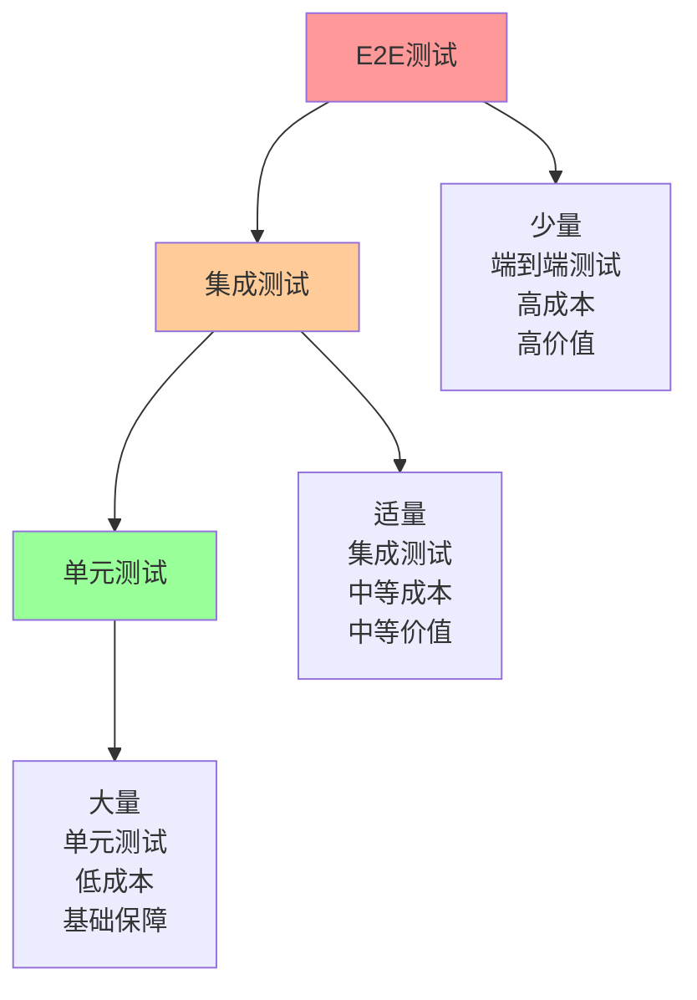

# 前端自动化测试策略与实践（一）- 测试基础与单元测试

## 前端测试概述

### 为什么需要自动化测试

前端自动化测试的重要性体现在以下几个方面：

1. **提高代码质量**：通过测试发现和修复bug
2. **保证功能稳定性**：防止新功能破坏现有功能
3. **降低回归成本**：自动化测试减少手动回归测试的工作量
4. **促进重构**：有测试保障的重构更加安全
5. **改善设计**：编写测试的过程会促使代码更加模块化

### 测试金字塔

测试金字塔是一个指导测试策略的模型，从下到上分为三层：



1. **单元测试**：测试单个函数或组件，数量最多，执行最快
2. **集成测试**：测试多个组件或模块的协作，数量适中，执行速度中等
3. **端到端测试**：模拟用户完整操作流程，数量最少，执行最慢

### 测试分类

#### 按测试目的分类

1. **功能测试**：验证功能是否符合需求
2. **性能测试**：验证系统性能指标
3. **安全测试**：发现安全漏洞
4. **兼容性测试**：验证不同环境下的兼容性
5. **可用性测试**：评估用户体验

#### 按测试阶段分类

1. **单元测试**：测试最小可测试单元
2. **集成测试**：测试模块间的交互
3. **系统测试**：测试整个系统功能
4. **验收测试**：验证系统是否满足用户需求

## 单元测试

### 单元测试基础

单元测试是针对程序中最小可测试单元进行的测试，通常是一个函数、方法或组件。

#### 单元测试原则

1. **快速**：单元测试应该快速执行
2. **独立**：测试之间不应相互依赖
3. **可重复**：测试结果应该一致
4. **自验证**：测试应该自动判断通过或失败
5. **及时**：应该在编写代码后立即编写测试

#### 单元测试结构

每个单元测试通常包含三个部分：

1. **Arrange（准备）**：设置测试数据和条件
2. **Act（执行）**：调用被测试的函数或方法
3. **Assert（断言）**：验证结果是否符合预期

```javascript
// 示例：测试一个计算折扣的函数
describe('calculateDiscount', () => {
  test('应该为VIP用户计算正确的折扣', () => {
    // Arrange
    const user = { type: 'VIP', points: 1000 };
    const originalPrice = 100;
    
    // Act
    const discountedPrice = calculateDiscount(user, originalPrice);
    
    // Assert
    expect(discountedPrice).toBe(80); // VIP用户享受8折优惠
  });
  
  test('应该为普通用户计算正确的折扣', () => {
    // Arrange
    const user = { type: 'NORMAL', points: 100 };
    const originalPrice = 100;
    
    // Act
    const discountedPrice = calculateDiscount(user, originalPrice);
    
    // Assert
    expect(discountedPrice).toBe(95); // 普通用户享受9.5折优惠
  });
});
```

### Jest框架详解

Jest是Facebook开发的JavaScript测试框架，广泛应用于React项目。

#### Jest配置

```javascript
// jest.config.js
module.exports = {
  // 测试环境
  testEnvironment: 'jsdom',
  
  // 测试文件匹配模式
  testMatch: [
    '**/__tests__/**/*.(js|jsx|ts|tsx)',
    '**/*.(test|spec).(js|jsx|ts|tsx)'
  ],
  
  // 覆盖率收集
  collectCoverage: true,
  collectCoverageFrom: [
    'src/**/*.(js|jsx|ts|tsx)',
    '!src/**/*.d.ts',
    '!src/index.js',
    '!src/serviceWorker.js'
  ],
  coverageDirectory: 'coverage',
  coverageReporters: ['text', 'lcov', 'html'],
  coverageThreshold: {
    global: {
      branches: 80,
      functions: 80,
      lines: 80,
      statements: 80
    }
  },
  
  // 模块路径映射
  moduleNameMapping: {
    '^@/(.*)$': '<rootDir>/src/$1'
  },
  
  // 设置文件
  setupFilesAfterEnv: ['<rootDir>/src/setupTests.js'],
  
  // 转换配置
  transform: {
    '^.+\\.(js|jsx|ts|tsx)$': 'babel-jest'
  },
  
  // 忽略转换的文件
  transformIgnorePatterns: [
    'node_modules/(?!(axios)/)'
  ],
  
  // 模块文件扩展名
  moduleFileExtensions: ['js', 'jsx', 'ts', 'tsx', 'json'],
  
  // 测试超时时间
  testTimeout: 5000
};
```

#### Jest常用API

```javascript
// 分组测试
describe('用户服务', () => {
  // 前置操作
  beforeEach(() => {
    // 每个测试前执行
  });
  
  beforeAll(() => {
    // 所有测试前执行一次
  });
  
  // 后置操作
  afterEach(() => {
    // 每个测试后执行
  });
  
  afterAll(() => {
    // 所有测试后执行一次
  });
  
  // 测试用例
  test('应该创建新用户', () => {
    // 测试代码
  });
  
  // 异步测试
  test('应该异步获取用户数据', async () => {
    const userData = await userService.getUserById(1);
    expect(userData).toBeDefined();
  });
  
  // 测试Promise
  test('应该返回Promise', () => {
    expect(userService.createUser({})).resolves.toBeDefined();
  });
  
  // 测试错误
  test('应该抛出错误', () => {
    expect(() => userService.getUserById(-1)).toThrow();
  });
  
  // 测试回调函数
  test('应该调用回调函数', (done) => {
    userService.getUserById(1, (user) => {
      expect(user).toBeDefined();
      done();
    });
  });
});
```

#### Jest Mock功能

```javascript
// 模拟函数
const mockFn = jest.fn();
mockFn('arg1', 'arg2');
expect(mockFn).toHaveBeenCalledWith('arg1', 'arg2');
expect(mockFn).toHaveBeenCalledTimes(1);

// 模拟返回值
const mockFn = jest.fn().mockReturnValue('return value');
expect(mockFn()).toBe('return value');

// 模拟Promise
const mockFn = jest.fn().mockResolvedValue('resolved value');
await expect(mockFn()).resolves.toBe('resolved value');

// 模拟模块
jest.mock('./api', () => ({
  fetchUser: jest.fn(() => Promise.resolve({ id: 1, name: 'John' }))
}));

// 模拟部分模块
jest.mock('./utils', () => {
  const originalModule = jest.requireActual('./utils');
  return {
    ...originalModule,
    formatDate: jest.fn(() => '2023-01-01')
  };
});
```

### React组件测试

#### React Testing Library

React Testing Library是一个用于测试React组件的库，强调测试用户行为而非实现细节。

```javascript
// Button.test.js
import React from 'react';
import { render, screen, fireEvent } from '@testing-library/react';
import Button from './Button';

describe('Button组件', () => {
  test('应该渲染按钮文本', () => {
    render(<Button>Click me</Button>);
    expect(screen.getByText('Click me')).toBeInTheDocument();
  });
  
  test('应该响应点击事件', () => {
    const handleClick = jest.fn();
    render(<Button onClick={handleClick}>Click me</Button>);
    
    fireEvent.click(screen.getByText('Click me'));
    expect(handleClick).toHaveBeenCalledTimes(1);
  });
  
  test('应该应用正确的样式类', () => {
    render(<Button variant="primary">Click me</Button>);
    const button = screen.getByText('Click me');
    expect(button).toHaveClass('btn', 'btn-primary');
  });
  
  test('应该在禁用状态下不响应点击', () => {
    const handleClick = jest.fn();
    render(
      <Button disabled onClick={handleClick}>
        Click me
      </Button>
    );
    
    fireEvent.click(screen.getByText('Click me'));
    expect(handleClick).not.toHaveBeenCalled();
  });
});
```

#### 复杂组件测试

```javascript
// UserList.test.js
import React from 'react';
import { render, screen, waitFor, fireEvent } from '@testing-library/react';
import UserList from './UserList';
import { fetchUsers } from '../api/users';

// 模拟API
jest.mock('../api/users');

describe('UserList组件', () => {
  beforeEach(() => {
    fetchUsers.mockClear();
  });
  
  test('应该显示加载状态', () => {
    fetchUsers.mockReturnValue(new Promise(() => {}));
    render(<UserList />);
    expect(screen.getByText('加载中...')).toBeInTheDocument();
  });
  
  test('应该显示用户列表', async () => {
    const mockUsers = [
      { id: 1, name: 'John Doe', email: 'john@example.com' },
      { id: 2, name: 'Jane Smith', email: 'jane@example.com' }
    ];
    
    fetchUsers.mockResolvedValue(mockUsers);
    render(<UserList />);
    
    await waitFor(() => {
      expect(screen.getByText('John Doe')).toBeInTheDocument();
      expect(screen.getByText('jane@example.com')).toBeInTheDocument();
    });
  });
  
  test('应该处理API错误', async () => {
    fetchUsers.mockRejectedValue(new Error('API Error'));
    render(<UserList />);
    
    await waitFor(() => {
      expect(screen.getByText(/加载失败/)).toBeInTheDocument();
    });
  });
  
  test('应该响应搜索输入', async () => {
    const mockUsers = [
      { id: 1, name: 'John Doe', email: 'john@example.com' },
      { id: 2, name: 'Jane Smith', email: 'jane@example.com' }
    ];
    
    fetchUsers.mockResolvedValue(mockUsers);
    render(<UserList />);
    
    // 等待用户列表加载
    await waitFor(() => {
      expect(screen.getByText('John Doe')).toBeInTheDocument();
    });
    
    // 输入搜索关键词
    const searchInput = screen.getByPlaceholderText('搜索用户');
    fireEvent.change(searchInput, { target: { value: 'John' } });
    
    // 验证过滤结果
    expect(screen.getByText('John Doe')).toBeInTheDocument();
    expect(screen.queryByText('Jane Smith')).not.toBeInTheDocument();
  });
});
```

## 测试覆盖率策略

### 代码覆盖率指标

1. **行覆盖率**：执行的代码行比例
2. **函数覆盖率**：调用的函数比例
3. **分支覆盖率**：执行的代码分支比例
4. **语句覆盖率**：执行的语句比例

### 覆盖率目标设定

```javascript
// jest.config.js
module.exports = {
  collectCoverage: true,
  collectCoverageFrom: [
    'src/**/*.{js,jsx,ts,tsx}',
    '!src/**/*.d.ts',
    '!src/index.js',
    '!src/serviceWorker.js'
  ],
  coverageDirectory: 'coverage',
  coverageReporters: ['text', 'lcov', 'html'],
  coverageThreshold: {
    global: {
      branches: 80,
      functions: 80,
      lines: 80,
      statements: 80
    },
    // 核心业务逻辑要求更高覆盖率
    './src/services/': {
      branches: 90,
      functions: 90,
      lines: 90,
      statements: 90
    },
    // 工具函数要求最高覆盖率
    './src/utils/': {
      branches: 95,
      functions: 95,
      lines: 95,
      statements: 95
    }
  }
};
```

## 测试数据管理

### 测试数据策略

1. **固定测试数据**：使用固定的测试数据，确保测试结果可预测
2. **随机测试数据**：使用随机数据测试边界情况
3. **工厂模式**：使用工厂函数创建测试数据
4. **数据清理**：确保测试之间数据隔离

```javascript
// 测试数据工厂
const userFactory = (overrides = {}) => {
  return {
    id: faker.datatype.number(),
    name: faker.name.findName(),
    email: faker.internet.email(),
    department: faker.random.arrayElement(['IT', 'HR', 'Finance']),
    createdAt: faker.date.past(),
    ...overrides
  };
};

// 使用示例
test('应该正确显示用户信息', () => {
  const user = userFactory({ name: 'John Doe' });
  render(<UserProfile user={user} />);
  expect(screen.getByText('John Doe')).toBeInTheDocument();
});
```

## 单元测试最佳实践

### 测试编写原则

1. **测试用户行为而非实现**：测试用户能看到和交互的内容
2. **保持测试简单**：每个测试应该只验证一个行为
3. **使用有意义的断言**：断言应该明确表达预期结果
4. **避免测试实现细节**：测试应该对代码重构不敏感
5. **使用描述性测试名称**：测试名称应该清楚表达测试内容

### 测试维护策略

1. **定期审查测试**：删除过时或重复的测试
2. **重构测试代码**：保持测试代码的整洁
3. **监控测试执行时间**：优化慢速测试
4. **分析测试覆盖率**：识别未测试的代码区域
5. **更新测试文档**：保持测试文档与实际测试同步

## 总结

单元测试是前端自动化测试的基石，通过合理的单元测试策略和工具选择，我们可以：

1. **提高代码质量**：通过测试发现和修复bug
2. **加速开发流程**：自动化测试减少手动回归测试时间
3. **增强重构信心**：有测试保障的重构更加安全
4. **改善代码设计**：编写测试的过程会促使代码更加模块化

有效的单元测试策略应该：
- 遵循测试金字塔原则，建立坚实的测试基础
- 选择适合项目需求的测试框架和工具
- 建立完善的测试数据管理机制
- 持续监控和优化测试执行效率

通过持续实践和改进，团队可以建立起适合自身项目的单元测试体系，为项目的长期发展提供坚实保障。在下一篇文章中，我们将继续探讨集成测试和端到端测试的实践。