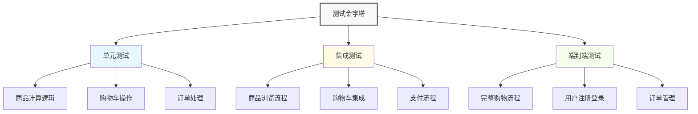

# 前端自动化测试策略与实践（二）- 集成测试与端到端测试

## 集成测试

### 集成测试基础

集成测试是测试多个组件或模块之间的交互，验证它们能否正确协作完成特定功能。

#### 集成测试场景

1. **组件间通信**：测试组件之间的数据传递和事件处理
2. **状态管理**：测试状态管理库与组件的集成
3. **API集成**：测试前端应用与后端API的交互
4. **路由集成**：测试路由导航和参数传递
5. **第三方库集成**：测试与第三方库的集成

#### React集成测试示例

```javascript
// UserManagement.test.js
import React from 'react';
import { render, screen, fireEvent, waitFor } from '@testing-library/react';
import { Provider } from 'react-redux';
import { BrowserRouter } from 'react-router-dom';
import { configureStore } from '@reduxjs/toolkit';
import UserManagement from '../components/UserManagement';
import userReducer from '../store/userSlice';
import { fetchUsers, createUser, updateUser } from '../store/userSlice';

// 创建测试store
const createTestStore = (initialState = {}) => {
  return configureStore({
    reducer: {
      users: userReducer
    },
    preloadedState: {
      users: {
        users: [],
        status: 'idle',
        error: null,
        ...initialState.users
      }
    }
  });
};

// 测试组件包装器
const renderWithProviders = (
  ui,
  { initialState = {}, store = createTestStore(initialState) } = {}
) => {
  const Wrapper = ({ children }) => (
    <Provider store={store}>
      <BrowserRouter>
        {children}
      </BrowserRouter>
    </Provider>
  );

  return render(ui, { wrapper: Wrapper });
};

describe('UserManagement集成测试', () => {
  let store;
  
  beforeEach(() => {
    store = createTestStore();
    // 模拟API调用
    jest.spyOn(store, 'dispatch');
  });
  
  afterEach(() => {
    jest.restoreAllMocks();
  });
  
  test('应该显示用户列表并支持创建新用户', async () => {
    // 初始状态
    const initialState = {
      users: {
        users: [
          { id: 1, name: 'John Doe', email: 'john@example.com' },
          { id: 2, name: 'Jane Smith', email: 'jane@example.com' }
        ],
        status: 'succeeded',
        error: null
      }
    };
    
    renderWithProviders(<UserManagement />, { initialState });
    
    // 验证用户列表显示
    expect(screen.getByText('John Doe')).toBeInTheDocument();
    expect(screen.getByText('jane@example.com')).toBeInTheDocument();
    
    // 点击添加用户按钮
    fireEvent.click(screen.getByText('添加用户'));
    
    // 填写用户表单
    fireEvent.change(screen.getByLabelText('姓名'), {
      target: { value: 'New User' }
    });
    fireEvent.change(screen.getByLabelText('邮箱'), {
      target: { value: 'newuser@example.com' }
    });
    
    // 提交表单
    fireEvent.click(screen.getByText('保存'));
    
    // 验证createUser action被调用
    await waitFor(() => {
      expect(store.dispatch).toHaveBeenCalledWith(
        expect.objectContaining({
          type: createUser.pending.type
        })
      );
    });
  });
  
  test('应该支持编辑用户信息', async () => {
    const initialState = {
      users: {
        users: [
          { id: 1, name: 'John Doe', email: 'john@example.com' }
        ],
        status: 'succeeded',
        error: null
      }
    };
    
    renderWithProviders(<UserManagement />, { initialState });
    
    // 点击编辑按钮
    fireEvent.click(screen.getByText('编辑'));
    
    // 修改用户信息
    fireEvent.change(screen.getByLabelText('姓名'), {
      target: { value: 'John Updated' }
    });
    
    // 提交表单
    fireEvent.click(screen.getByText('保存'));
    
    // 验证updateUser action被调用
    await waitFor(() => {
      expect(store.dispatch).toHaveBeenCalledWith(
        expect.objectContaining({
          type: updateUser.pending.type
        })
      );
    });
  });
});
```

## 端到端测试

### 端到端测试基础

端到端测试（E2E测试）模拟真实用户操作流程，验证整个应用从前端到后端的完整功能。

#### 端到端测试工具对比

| 工具 | 优点 | 缺点 | 适用场景 |
|------|------|------|----------|
| Cypress | 快速、易用、调试友好 | 仅支持单个浏览器 | 大多数Web应用 |
| Playwright | 多浏览器支持、强大API | 相对复杂 | 需要跨浏览器测试的应用 |
| Selenium | 成熟、多语言支持 | 速度慢、API复杂 | 大型企业级应用 |
| TestCafe | 无需WebDriver、简单 | 插件生态较小 | 中小型项目 |

### Cypress配置与使用

#### Cypress配置

```javascript
// cypress.config.js
const { defineConfig } = require('cypress');

module.exports = defineConfig({
  // 测试文件位置
  specPattern: 'cypress/e2e/**/*.cy.{js,jsx,ts,tsx}',
  
  // 测试环境
  env: {
    apiUrl: 'http://localhost:3001/api'
  },
  
  // 浏览器配置
  viewportWidth: 1280,
  viewportHeight: 720,
  video: true,
  screenshotOnRunFailure: true,
  
  // 服务器配置
  devServer: {
    port: 3000,
    framework: 'create-react-app'
  },
  
  // 任务配置
  setupNodeEvents(on, config) {
    // 可以在这里添加自定义任务和插件
  },
  
  // 测试超时时间
  defaultCommandTimeout: 10000,
  requestTimeout: 10000,
  responseTimeout: 10000,
  
  // 测试报告
  reporter: 'cypress-mochawesome-reporter',
  reporterOptions: {
    reportDir: 'cypress/reports',
    charts: true,
    reportPageTitle: 'Cypress测试报告'
  }
});
```

#### Cypress测试示例

```javascript
// cypress/e2e/user-management.cy.js
describe('用户管理端到端测试', () => {
  beforeEach(() => {
    // 访问应用首页
    cy.visit('/');
    
    // 模拟登录
    cy.login('admin@example.com', 'password');
  });
  
  it('应该能够创建、编辑和删除用户', () => {
    // 导航到用户管理页面
    cy.get('[data-testid=nav-users]').click();
    cy.url().should('include', '/users');
    
    // 创建新用户
    cy.get('[data-testid=add-user-btn]').click();
    cy.get('[data-testid=user-name-input]').type('Test User');
    cy.get('[data-testid=user-email-input]').type('test@example.com');
    cy.get('[data-testid=user-department-select]').select('IT');
    cy.get('[data-testid=save-user-btn]').click();
    
    // 验证用户创建成功
    cy.contains('用户创建成功').should('be.visible');
    cy.contains('Test User').should('be.visible');
    cy.contains('test@example.com').should('be.visible');
    
    // 编辑用户
    cy.contains('Test User').parents('[data-testid=user-row]').find('[data-testid=edit-btn]').click();
    cy.get('[data-testid=user-name-input]').clear().type('Updated User');
    cy.get('[data-testid=save-user-btn]').click();
    
    // 验证用户更新成功
    cy.contains('用户更新成功').should('be.visible');
    cy.contains('Updated User').should('be.visible');
    
    // 删除用户
    cy.contains('Updated User').parents('[data-testid=user-row]').find('[data-testid=delete-btn]').click();
    cy.get('[data-testid=confirm-delete-btn]').click();
    
    // 验证用户删除成功
    cy.contains('用户删除成功').should('be.visible');
    cy.contains('Updated User').should('not.exist');
  });
  
  it('应该能够搜索和过滤用户', () => {
    // 导航到用户管理页面
    cy.get('[data-testid=nav-users]').click();
    
    // 搜索用户
    cy.get('[data-testid=search-input]').type('John');
    cy.get('[data-testid=search-btn]').click();
    
    // 验证搜索结果
    cy.get('[data-testid=user-row]').should('contain', 'John');
    cy.get('[data-testid=user-row]').should('not.contain', 'Jane');
    
    // 按部门过滤
    cy.get('[data-testid=department-filter]').select('IT');
    cy.get('[data-testid=filter-btn]').click();
    
    // 验证过滤结果
    cy.get('[data-testid=user-row]').each(($el) => {
      cy.wrap($el).should('contain', 'IT');
    });
  });
});
```

#### Cypress自定义命令

```javascript
// cypress/support/commands.js
Cypress.Commands.add('login', (email, password) => {
  cy.visit('/login');
  cy.get('[data-testid=email-input]').type(email);
  cy.get('[data-testid=password-input]').type(password);
  cy.get('[data-testid=login-btn]').click();
  cy.url().should('not.include', '/login');
});

Cypress.Commands.add('createUser', (userData) => {
  cy.request({
    method: 'POST',
    url: '/api/users',
    body: userData,
    headers: {
      Authorization: `Bearer ${window.localStorage.getItem('token')}`
    }
  });
});

Cypress.Commands.add('apiRequest', (method, url, body = null) => {
  const options = {
    method,
    url: `/api${url}`,
    headers: {
      Authorization: `Bearer ${window.localStorage.getItem('token')}`
    }
  };
  
  if (body) {
    options.body = body;
  }
  
  return cy.request(options);
});
```

## 测试策略制定

### 测试分层策略

```javascript
// 测试金字塔实践示例
describe('用户功能测试', () => {
  // 单元测试层
  describe('用户服务单元测试', () => {
    test('应该正确计算用户年龄', () => {
      const user = { birthDate: '1990-01-01' };
      const age = userService.calculateAge(user);
      expect(age).toBe(new Date().getFullYear() - 1990);
    });
  });
  
  // 集成测试层
  describe('用户组件集成测试', () => {
    test('应该正确显示用户列表', async () => {
      const mockUsers = [
        { id: 1, name: 'John', age: 30 },
        { id: 2, name: 'Jane', age: 25 }
      ];
      
      jest.spyOn(userService, 'getUsers').mockResolvedValue(mockUsers);
      
      render(<UserList />);
      
      await waitFor(() => {
        expect(screen.getByText('John')).toBeInTheDocument();
        expect(screen.getByText('Jane')).toBeInTheDocument();
      });
    });
  });
  
  // 端到端测试层
  describe('用户功能端到端测试', () => {
    test('应该完成用户创建流程', () => {
      cy.visit('/users');
      cy.get('[data-testid=add-user-btn]').click();
      cy.get('[data-testid=user-name-input]').type('New User');
      cy.get('[data-testid=save-user-btn]').click();
      cy.contains('用户创建成功').should('be.visible');
    });
  });
});
```

### 测试覆盖率策略

1. **核心业务逻辑**：要求高覆盖率（90%以上）
2. **用户界面组件**：要求中等覆盖率（80%以上）
3. **工具函数**：要求最高覆盖率（95%以上）
4. **配置文件**：要求低覆盖率（50%以上）

### 测试数据管理

#### 测试数据策略

1. **固定测试数据**：使用固定的测试数据，确保测试结果可预测
2. **随机测试数据**：使用随机数据测试边界情况
3. **工厂模式**：使用工厂函数创建测试数据
4. **数据清理**：确保测试之间数据隔离

```javascript
// 测试数据工厂
const userFactory = (overrides = {}) => {
  return {
    id: faker.datatype.number(),
    name: faker.name.findName(),
    email: faker.internet.email(),
    department: faker.random.arrayElement(['IT', 'HR', 'Finance']),
    createdAt: faker.date.past(),
    ...overrides
  };
};

// 使用示例
test('应该正确显示用户信息', () => {
  const user = userFactory({ name: 'John Doe' });
  render(<UserProfile user={user} />);
  expect(screen.getByText('John Doe')).toBeInTheDocument();
});
```

## 测试最佳实践

### 测试编写原则

1. **测试用户行为而非实现**：测试用户能看到和交互的内容
2. **保持测试简单**：每个测试应该只验证一个行为
3. **使用有意义的断言**：断言应该明确表达预期结果
4. **避免测试实现细节**：测试应该对代码重构不敏感
5. **使用描述性测试名称**：测试名称应该清楚表达测试内容

### 测试维护策略

1. **定期审查测试**：删除过时或重复的测试
2. **重构测试代码**：保持测试代码的整洁
3. **监控测试执行时间**：优化慢速测试
4. **分析测试覆盖率**：识别未测试的代码区域
5. **更新测试文档**：保持测试文档与实际测试同步

## 实际应用案例

### 电商平台测试架构



### 测试配置示例

```javascript
// jest.config.js
module.exports = {
  testEnvironment: 'jsdom',
  setupFilesAfterEnv: ['<rootDir>/src/setupTests.js'],
  moduleNameMapping: {
    '^@/(.*)$': '<rootDir>/src/$1'
  },
  collectCoverageFrom: [
    'src/**/*.{js,jsx,ts,tsx}',
    '!src/**/*.d.ts',
    '!src/index.js'
  ],
  coverageThreshold: {
    global: {
      branches: 80,
      functions: 80,
      lines: 80,
      statements: 80
    },
    './src/services/': {
      branches: 90,
      functions: 90,
      lines: 90,
      statements: 90
    }
  }
};
```

### 购物流程端到端测试

```javascript
// cypress/e2e/shopping-flow.cy.js
describe('购物流程端到端测试', () => {
  beforeEach(() => {
    // 清空购物车
    cy.window().then((win) => {
      win.localStorage.removeItem('cart');
    });
  });
  
  it('应该完成完整的购物流程', () => {
    // 访问首页
    cy.visit('/');
    
    // 搜索商品
    cy.get('[data-testid=search-input]').type('iPhone');
    cy.get('[data-testid=search-btn]').click();
    
    // 选择商品
    cy.get('[data-testid=product-card]').first().within(() => {
      cy.get('[data-testid=product-name]').should('contain', 'iPhone');
      cy.get('[data-testid=add-to-cart-btn]').click();
    });
    
    // 验证购物车更新
    cy.get('[data-testid=cart-count]').should('contain', '1');
    
    // 进入购物车
    cy.get('[data-testid=cart-btn]').click();
    cy.url().should('include', '/cart');
    
    // 验证商品在购物车中
    cy.get('[data-testid=cart-item]').should('have.length', 1);
    cy.get('[data-testid=cart-item]').first().should('contain', 'iPhone');
    
    // 进入结算
    cy.get('[data-testid=checkout-btn]').click();
    cy.url().should('include', '/checkout');
    
    // 填写收货信息
    cy.get('[data-testid=shipping-name]').type('John Doe');
    cy.get('[data-testid=shipping-address]').type('123 Main St');
    cy.get('[data-testid=shipping-city]').type('New York');
    cy.get('[data-testid=shipping-zip]').type('10001');
    
    // 选择支付方式
    cy.get('[data-testid=payment-method]').select('credit-card');
    cy.get('[data-testid=card-number]').type('4111111111111111');
    cy.get('[data-testid=card-expiry]').type('12/25');
    cy.get('[data-testid=card-cvv]').type('123');
    
    // 提交订单
    cy.get('[data-testid=place-order-btn]').click();
    
    // 验证订单创建成功
    cy.url().should('include', '/order-confirmation');
    cy.get('[data-testid=order-number]').should('exist');
    cy.get('[data-testid=order-success-message]').should('contain', '订单创建成功');
  });
});
```

### 性能测试集成

```javascript
// cypress/e2e/performance.cy.js
describe('性能测试', () => {
  it('页面加载时间应该在合理范围内', () => {
    cy.visit('/');
    
    // 使用cy.window()获取性能指标
    cy.window().then((win) => {
      const perfData = win.performance.getEntriesByType('navigation')[0];
      const loadTime = perfData.loadEventEnd - perfData.loadEventStart;
      
      // 页面加载时间应该小于3秒
      expect(loadTime).to.be.lessThan(3000);
    });
  });
  
  it('API响应时间应该在合理范围内', () => {
    cy.intercept('GET', '/api/products', (req) => {
      const startTime = Date.now();
      
      req.on('response', (res) => {
        const responseTime = Date.now() - startTime;
        
        // API响应时间应该小于1秒
        expect(responseTime).to.be.lessThan(1000);
      });
    }).as('getProducts');
    
    cy.visit('/products');
    cy.wait('@getProducts');
  });
});
```

## 总结

前端自动化测试是确保应用质量的重要手段，通过合理的测试策略和工具选择，我们可以：

1. **提高代码质量**：通过测试发现和修复bug
2. **加速开发流程**：自动化测试减少手动回归测试时间
3. **增强重构信心**：有测试保障的重构更加安全
4. **改善用户体验**：确保应用功能稳定可靠

有效的测试策略应该：
- 遵循测试金字塔原则，合理分配测试资源
- 选择适合项目需求的测试框架和工具
- 建立完善的测试数据管理机制
- 持续监控和优化测试执行效率
- 将测试集成到CI/CD流程中

通过持续实践和改进，团队可以建立起适合自身项目的自动化测试体系，为项目的长期发展提供坚实保障。测试不是一次性任务，而是需要持续投入和优化的长期过程。