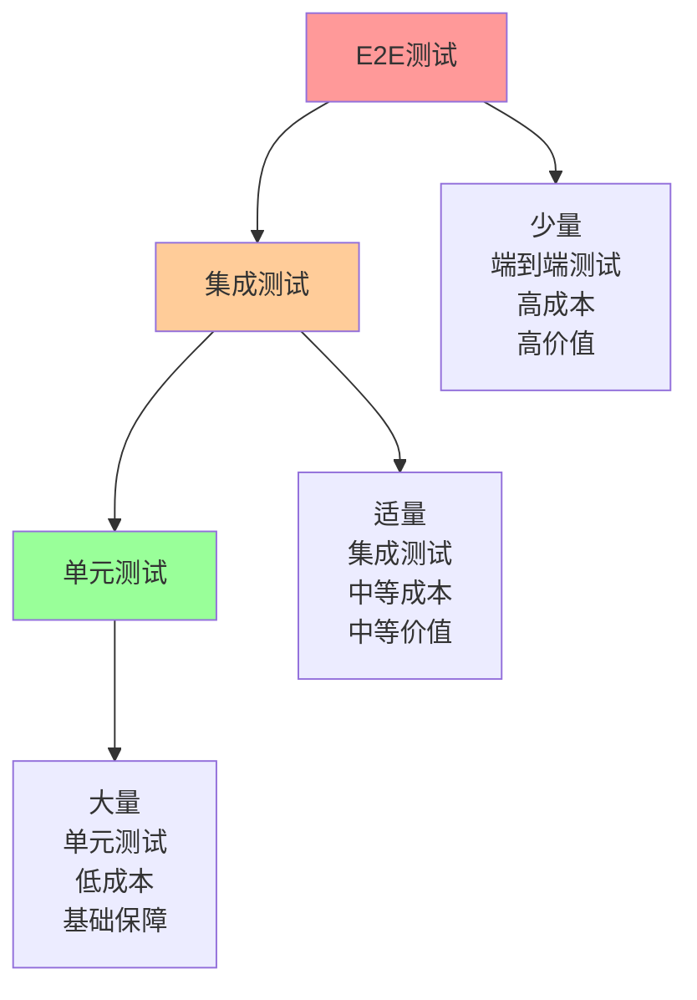
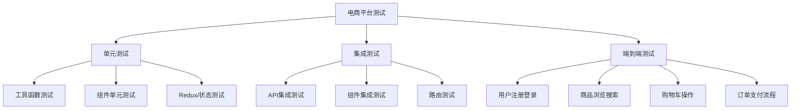

# 前端自动化测试策略与实践

## 前端测试概述

### 为什么需要自动化测试

前端自动化测试的重要性体现在以下几个方面：

1. **提高代码质量**：通过测试发现和修复bug
2. **保证功能稳定性**：防止新功能破坏现有功能
3. **降低回归成本**：自动化测试减少手动回归测试的工作量
4. **促进重构**：有测试保障的重构更加安全
5. **改善设计**：编写测试的过程会促使代码更加模块化

### 测试金字塔

测试金字塔是一个指导测试策略的模型，从下到上分为三层：



1. **单元测试**：测试单个函数或组件，数量最多，执行最快
2. **集成测试**：测试多个组件或模块的协作，数量适中，执行速度中等
3. **端到端测试**：模拟用户完整操作流程，数量最少，执行最慢

### 测试分类

#### 按测试目的分类

1. **功能测试**：验证功能是否符合需求
2. **性能测试**：验证系统性能指标
3. **安全测试**：发现安全漏洞
4. **兼容性测试**：验证不同环境下的兼容性
5. **可用性测试**：评估用户体验

#### 按测试阶段分类

1. **单元测试**：测试最小可测试单元
2. **集成测试**：测试模块间的交互
3. **系统测试**：测试整个系统功能
4. **验收测试**：验证系统是否满足用户需求

## 单元测试

### 单元测试基础

单元测试是针对程序中最小可测试单元进行的测试，通常是一个函数、方法或组件。

#### 单元测试原则

1. **快速**：单元测试应该快速执行
2. **独立**：测试之间不应相互依赖
3. **可重复**：测试结果应该一致
4. **自验证**：测试应该自动判断通过或失败
5. **及时**：应该在编写代码后立即编写测试

#### 单元测试结构

每个单元测试通常包含三个部分：

1. **Arrange（准备）**：设置测试数据和条件
2. **Act（执行）**：调用被测试的函数或方法
3. **Assert（断言）**：验证结果是否符合预期

```javascript
// 示例：测试一个计算折扣的函数
describe('calculateDiscount', () => {
  test('应该为VIP用户计算正确的折扣', () => {
    // Arrange
    const user = { type: 'VIP', points: 1000 };
    const originalPrice = 100;
    
    // Act
    const discountedPrice = calculateDiscount(user, originalPrice);
    
    // Assert
    expect(discountedPrice).toBe(80); // VIP用户享受8折优惠
  });
  
  test('应该为普通用户计算正确的折扣', () => {
    // Arrange
    const user = { type: 'NORMAL', points: 100 };
    const originalPrice = 100;
    
    // Act
    const discountedPrice = calculateDiscount(user, originalPrice);
    
    // Assert
    expect(discountedPrice).toBe(95); // 普通用户享受9.5折优惠
  });
});
```

### Jest框架详解

Jest是Facebook开发的JavaScript测试框架，广泛应用于React项目。

#### Jest配置

```javascript
// jest.config.js
module.exports = {
  // 测试环境
  testEnvironment: 'jsdom',
  
  // 测试文件匹配模式
  testMatch: [
    '**/__tests__/**/*.(js|jsx|ts|tsx)',
    '**/*.(test|spec).(js|jsx|ts|tsx)'
  ],
  
  // 覆盖率收集
  collectCoverage: true,
  collectCoverageFrom: [
    'src/**/*.(js|jsx|ts|tsx)',
    '!src/**/*.d.ts',
    '!src/index.js',
    '!src/serviceWorker.js'
  ],
  coverageDirectory: 'coverage',
  coverageReporters: ['text', 'lcov', 'html'],
  coverageThreshold: {
    global: {
      branches: 80,
      functions: 80,
      lines: 80,
      statements: 80
    }
  },
  
  // 模块路径映射
  moduleNameMapping: {
    '^@/(.*)$': '<rootDir>/src/$1'
  },
  
  // 设置文件
  setupFilesAfterEnv: ['<rootDir>/src/setupTests.js'],
  
  // 转换配置
  transform: {
    '^.+\\.(js|jsx|ts|tsx)$': 'babel-jest'
  },
  
  // 忽略转换的文件
  transformIgnorePatterns: [
    'node_modules/(?!(axios)/)'
  ],
  
  // 模块文件扩展名
  moduleFileExtensions: ['js', 'jsx', 'ts', 'tsx', 'json'],
  
  // 测试超时时间
  testTimeout: 5000
};
```

#### Jest常用API

```javascript
// 分组测试
describe('用户服务', () => {
  // 前置操作
  beforeEach(() => {
    // 每个测试前执行
  });
  
  beforeAll(() => {
    // 所有测试前执行一次
  });
  
  // 后置操作
  afterEach(() => {
    // 每个测试后执行
  });
  
  afterAll(() => {
    // 所有测试后执行一次
  });
  
  // 测试用例
  test('应该创建新用户', () => {
    // 测试代码
  });
  
  // 异步测试
  test('应该异步获取用户数据', async () => {
    const userData = await userService.getUserById(1);
    expect(userData).toBeDefined();
  });
  
  // 测试Promise
  test('应该返回Promise', () => {
    expect(userService.createUser({})).resolves.toBeDefined();
  });
  
  // 测试错误
  test('应该抛出错误', () => {
    expect(() => userService.getUserById(-1)).toThrow();
  });
  
  // 测试回调函数
  test('应该调用回调函数', (done) => {
    userService.getUserById(1, (user) => {
      expect(user).toBeDefined();
      done();
    });
  });
});
```

#### Jest Mock功能

```javascript
// 模拟函数
const mockFn = jest.fn();
mockFn('arg1', 'arg2');
expect(mockFn).toHaveBeenCalledWith('arg1', 'arg2');
expect(mockFn).toHaveBeenCalledTimes(1);

// 模拟返回值
const mockFn = jest.fn().mockReturnValue('return value');
expect(mockFn()).toBe('return value');

// 模拟Promise
const mockFn = jest.fn().mockResolvedValue('resolved value');
await expect(mockFn()).resolves.toBe('resolved value');

// 模拟模块
jest.mock('./api', () => ({
  fetchUser: jest.fn(() => Promise.resolve({ id: 1, name: 'John' }))
}));

// 模拟部分模块
jest.mock('./utils', () => {
  const originalModule = jest.requireActual('./utils');
  return {
    ...originalModule,
    formatDate: jest.fn(() => '2023-01-01')
  };
});
```

### React组件测试

#### React Testing Library

React Testing Library是一个用于测试React组件的库，强调测试用户行为而非实现细节。

```javascript
// Button.test.js
import React from 'react';
import { render, screen, fireEvent } from '@testing-library/react';
import Button from './Button';

describe('Button组件', () => {
  test('应该渲染按钮文本', () => {
    render(<Button>Click me</Button>);
    expect(screen.getByText('Click me')).toBeInTheDocument();
  });
  
  test('应该响应点击事件', () => {
    const handleClick = jest.fn();
    render(<Button onClick={handleClick}>Click me</Button>);
    
    fireEvent.click(screen.getByText('Click me'));
    expect(handleClick).toHaveBeenCalledTimes(1);
  });
  
  test('应该应用正确的样式类', () => {
    render(<Button variant="primary">Click me</Button>);
    const button = screen.getByText('Click me');
    expect(button).toHaveClass('btn', 'btn-primary');
  });
  
  test('应该在禁用状态下不响应点击', () => {
    const handleClick = jest.fn();
    render(
      <Button disabled onClick={handleClick}>
        Click me
      </Button>
    );
    
    fireEvent.click(screen.getByText('Click me'));
    expect(handleClick).not.toHaveBeenCalled();
  });
});
```

#### 复杂组件测试

```javascript
// UserList.test.js
import React from 'react';
import { render, screen, waitFor, fireEvent } from '@testing-library/react';
import UserList from './UserList';
import { fetchUsers } from '../api/users';

// 模拟API
jest.mock('../api/users');

describe('UserList组件', () => {
  beforeEach(() => {
    fetchUsers.mockClear();
  });
  
  test('应该显示加载状态', () => {
    fetchUsers.mockReturnValue(new Promise(() => {}));
    render(<UserList />);
    expect(screen.getByText('加载中...')).toBeInTheDocument();
  });
  
  test('应该显示用户列表', async () => {
    const mockUsers = [
      { id: 1, name: 'John Doe', email: 'john@example.com' },
      { id: 2, name: 'Jane Smith', email: 'jane@example.com' }
    ];
    
    fetchUsers.mockResolvedValue(mockUsers);
    render(<UserList />);
    
    await waitFor(() => {
      expect(screen.getByText('John Doe')).toBeInTheDocument();
      expect(screen.getByText('jane@example.com')).toBeInTheDocument();
    });
  });
  
  test('应该处理API错误', async () => {
    fetchUsers.mockRejectedValue(new Error('API Error'));
    render(<UserList />);
    
    await waitFor(() => {
      expect(screen.getByText(/加载失败/)).toBeInTheDocument();
    });
  });
  
  test('应该响应搜索输入', async () => {
    const mockUsers = [
      { id: 1, name: 'John Doe', email: 'john@example.com' },
      { id: 2, name: 'Jane Smith', email: 'jane@example.com' }
    ];
    
    fetchUsers.mockResolvedValue(mockUsers);
    render(<UserList />);
    
    // 等待用户列表加载
    await waitFor(() => {
      expect(screen.getByText('John Doe')).toBeInTheDocument();
    });
    
    // 输入搜索关键词
    const searchInput = screen.getByPlaceholderText('搜索用户');
    fireEvent.change(searchInput, { target: { value: 'John' } });
    
    // 验证过滤结果
    expect(screen.getByText('John Doe')).toBeInTheDocument();
    expect(screen.queryByText('Jane Smith')).not.toBeInTheDocument();
  });
});
```

## 集成测试

### 集成测试基础

集成测试是测试多个组件或模块协同工作的测试，介于单元测试和端到端测试之间。

#### 集成测试场景

1. **组件间交互**：测试多个组件之间的数据流和事件传递
2. **API集成**：测试前端与后端API的交互
3. **状态管理**：测试状态管理库的行为
4. **路由导航**：测试应用的路由功能

### React集成测试示例

```javascript
// UserManagement.test.js
import React from 'react';
import { render, screen, fireEvent, waitFor } from '@testing-library/react';
import { BrowserRouter } from 'react-router-dom';
import { Provider } from 'react-redux';
import { configureStore } from '@reduxjs/toolkit';
import UserManagement from './UserManagement';
import usersReducer from '../store/usersSlice';

// 创建测试store
const createTestStore = (initialState = {}) => {
  return configureStore({
    reducer: {
      users: usersReducer
    },
    preloadedState: {
      users: {
        users: [],
        status: 'idle',
        error: null,
        ...initialState.users
      }
    }
  });
};

// 测试包装器
const renderWithProviders = (
  ui,
  { initialState = {}, store = createTestStore(initialState) } = {}
) => {
  const Wrapper = ({ children }) => (
    <Provider store={store}>
      <BrowserRouter>
        {children}
      </BrowserRouter>
    </Provider>
  );
  
  return render(ui, { wrapper: Wrapper });
};

describe('UserManagement集成测试', () => {
  test('应该完成用户创建流程', async () => {
    const store = createTestStore();
    
    renderWithProviders(<UserManagement />, { store });
    
    // 验证初始状态
    expect(screen.getByText('用户管理')).toBeInTheDocument();
    expect(screen.getByText('暂无用户数据')).toBeInTheDocument();
    
    // 点击添加用户按钮
    fireEvent.click(screen.getByText('添加用户'));
    
    // 填写用户表单
    fireEvent.change(screen.getByLabelText('姓名'), {
      target: { value: 'John Doe' }
    });
    fireEvent.change(screen.getByLabelText('邮箱'), {
      target: { value: 'john@example.com' }
    });
    fireEvent.change(screen.getByLabelText('部门'), {
      target: { value: 'IT' }
    });
    
    // 提交表单
    fireEvent.click(screen.getByText('保存'));
    
    // 验证用户已添加到列表
    await waitFor(() => {
      expect(screen.getByText('John Doe')).toBeInTheDocument();
      expect(screen.getByText('john@example.com')).toBeInTheDocument();
      expect(screen.getByText('IT')).toBeInTheDocument();
    });
    
    // 验证store状态
    const state = store.getState();
    expect(state.users.users).toHaveLength(1);
    expect(state.users.users[0].name).toBe('John Doe');
  });
  
  test('应该完成用户编辑流程', async () => {
    const initialState = {
      users: {
        users: [
          { id: 1, name: 'John Doe', email: 'john@example.com', department: 'IT' }
        ],
        status: 'succeeded',
        error: null
      }
    };
    
    const store = createTestStore(initialState);
    
    renderWithProviders(<UserManagement />, { store });
    
    // 点击编辑按钮
    fireEvent.click(screen.getByText('编辑'));
    
    // 修改用户信息
    fireEvent.change(screen.getByLabelText('姓名'), {
      target: { value: 'Jane Doe' }
    });
    
    // 提交表单
    fireEvent.click(screen.getByText('保存'));
    
    // 验证用户信息已更新
    await waitFor(() => {
      expect(screen.getByText('Jane Doe')).toBeInTheDocument();
      expect(screen.queryByText('John Doe')).not.toBeInTheDocument();
    });
    
    // 验证store状态
    const state = store.getState();
    expect(state.users.users[0].name).toBe('Jane Doe');
  });
});
```

## 端到端测试

### 端到端测试基础

端到端测试模拟真实用户操作，从用户界面出发，验证整个应用的功能流程。

#### 端到端测试工具

1. **Cypress**：现代化的端到端测试框架
2. **Playwright**：Microsoft开发的跨浏览器测试工具
3. **Selenium**：经典的浏览器自动化工具
4. **TestCafe**：Node.js端到端测试框架

### Cypress实战

#### Cypress配置

```javascript
// cypress.config.js
const { defineConfig } = require('cypress');

module.exports = defineConfig({
  e2e: {
    baseUrl: 'http://localhost:3000',
    supportFile: 'cypress/support/e2e.js',
    specPattern: 'cypress/e2e/**/*.cy.{js,jsx,ts,tsx}',
    viewportWidth: 1280,
    viewportHeight: 720,
    video: true,
    screenshotOnRunFailure: true,
    defaultCommandTimeout: 10000,
    requestTimeout: 10000,
    responseTimeout: 10000,
    setupNodeEvents(on, config) {
      // 插件配置
    }
  }
});
```

#### Cypress测试示例

```javascript
// cypress/e2e/user-management.cy.js
describe('用户管理端到端测试', () => {
  beforeEach(() => {
    // 访问应用首页
    cy.visit('/');
    
    // 登录系统
    cy.get('[data-cy=username]').type('admin');
    cy.get('[data-cy=password]').type('password');
    cy.get('[data-cy=login-button]').click();
    
    // 验证登录成功
    cy.url().should('include', '/dashboard');
    cy.get('[data-cy=user-menu]').should('be.visible');
  });
  
  it('应该完成用户创建流程', () => {
    // 导航到用户管理页面
    cy.get('[data-cy=nav-users]').click();
    cy.url().should('include', '/users');
    
    // 点击添加用户按钮
    cy.get('[data-cy=add-user-btn]').click();
    
    // 填写用户表单
    cy.get('[data-cy=user-name]').type('John Doe');
    cy.get('[data-cy=user-email]').type('john@example.com');
    cy.get('[data-cy=user-department]').select('IT');
    
    // 提交表单
    cy.get('[data-cy=save-btn]').click();
    
    // 验证用户已添加
    cy.get('[data-cy=user-list]')
      .should('contain', 'John Doe')
      .and('contain', 'john@example.com')
      .and('contain', 'IT');
    
    // 验证成功提示
    cy.get('[data-cy=notification]')
      .should('be.visible')
      .and('contain', '用户创建成功');
  });
  
  it('应该完成用户编辑流程', () => {
    // 导航到用户管理页面
    cy.get('[data-cy=nav-users]').click();
    
    // 等待用户列表加载
    cy.get('[data-cy=user-list-item]').should('have.length.greaterThan', 0);
    
    // 点击第一个用户的编辑按钮
    cy.get('[data-cy=user-list-item]').first().within(() => {
      cy.get('[data-cy=edit-btn]').click();
    });
    
    // 修改用户信息
    cy.get('[data-cy=user-name]').clear().type('Jane Doe');
    
    // 提交表单
    cy.get('[data-cy=save-btn]').click();
    
    // 验证用户信息已更新
    cy.get('[data-cy=user-list]')
      .should('contain', 'Jane Doe')
      .and('not.contain', 'John Doe');
  });
  
  it('应该完成用户删除流程', () => {
    // 导航到用户管理页面
    cy.get('[data-cy=nav-users]').click();
    
    // 获取初始用户数量
    cy.get('[data-cy=user-list-item]').then($items => {
      const initialCount = $items.length;
      
      // 点击第一个用户的删除按钮
      cy.get('[data-cy=user-list-item]').first().within(() => {
        cy.get('[data-cy=delete-btn]').click();
      });
      
      // 确认删除
      cy.get('[data-cy=confirm-delete]').click();
      
      // 验证用户数量减少
      cy.get('[data-cy=user-list-item]').should('have.length', initialCount - 1);
      
      // 验证成功提示
      cy.get('[data-cy=notification]')
        .should('be.visible')
        .and('contain', '用户删除成功');
    });
  });
  
  it('应该正确处理搜索功能', () => {
    // 导航到用户管理页面
    cy.get('[data-cy=nav-users]').click();
    
    // 等待用户列表加载
    cy.get('[data-cy=user-list-item]').should('have.length.greaterThan', 0);
    
    // 输入搜索关键词
    cy.get('[data-cy=search-input]').type('John');
    
    // 验证搜索结果
    cy.get('[data-cy=user-list-item]').each($item => {
      cy.wrap($item).should('contain', 'John');
    });
    
    // 清空搜索
    cy.get('[data-cy=search-input]').clear();
    
    // 验证所有用户显示
    cy.get('[data-cy=user-list-item]').should('have.length.greaterThan', 0);
  });
});
```

#### Cypress自定义命令

```javascript
// cypress/support/commands.js
Cypress.Commands.add('login', (username, password) => {
  cy.visit('/login');
  cy.get('[data-cy=username]').type(username);
  cy.get('[data-cy=password]').type(password);
  cy.get('[data-cy=login-button]').click();
  cy.url().should('not.include', '/login');
});

Cypress.Commands.add('createUser', (userData) => {
  cy.get('[data-cy=nav-users]').click();
  cy.get('[data-cy=add-user-btn]').click();
  
  if (userData.name) {
    cy.get('[data-cy=user-name]').type(userData.name);
  }
  
  if (userData.email) {
    cy.get('[data-cy=user-email]').type(userData.email);
  }
  
  if (userData.department) {
    cy.get('[data-cy=user-department]').select(userData.department);
  }
  
  cy.get('[data-cy=save-btn]').click();
});

Cypress.Commands.add('apiRequest', (method, url, body = {}) => {
  return cy.request({
    method,
    url: `${Cypress.env('apiUrl')}${url}`,
    headers: {
      'Authorization': `Bearer ${Cypress.env('authToken')}`
    },
    body: Object.keys(body).length > 0 ? body : undefined
  });
});
```

## 测试策略制定

### 测试覆盖率策略

#### 代码覆盖率指标

1. **行覆盖率**：执行的代码行比例
2. **函数覆盖率**：调用的函数比例
3. **分支覆盖率**：执行的代码分支比例
4. **语句覆盖率**：执行的语句比例

#### 覆盖率目标设定

```javascript
// jest.config.js
module.exports = {
  collectCoverage: true,
  collectCoverageFrom: [
    'src/**/*.{js,jsx,ts,tsx}',
    '!src/**/*.d.ts',
    '!src/index.js',
    '!src/serviceWorker.js'
  ],
  coverageDirectory: 'coverage',
  coverageReporters: ['text', 'lcov', 'html'],
  coverageThreshold: {
    global: {
      branches: 80,
      functions: 80,
      lines: 80,
      statements: 80
    },
    // 核心业务逻辑要求更高覆盖率
    './src/services/': {
      branches: 90,
      functions: 90,
      lines: 90,
      statements: 90
    },
    // 工具函数要求最高覆盖率
    './src/utils/': {
      branches: 95,
      functions: 95,
      lines: 95,
      statements: 95
    }
  }
};
```

### 测试分层策略

#### 测试金字塔实践

```javascript
// 测试分层策略示例
describe('用户功能测试', () => {
  // 单元测试层：测试工具函数
  describe('formatUserName工具函数', () => {
    test('应该正确格式化用户名', () => {
      expect(formatUserName('john_doe')).toBe('John Doe');
    });
  });
  
  // 集成测试层：测试组件与API交互
  describe('UserList组件与API集成', () => {
    test('应该正确获取并显示用户列表', async () => {
      // 模拟API响应
      mockApi.getUsers.mockResolvedValue([
        { id: 1, name: 'John Doe' },
        { id: 2, name: 'Jane Smith' }
      ]);
      
      render(<UserList />);
      
      await waitFor(() => {
        expect(screen.getByText('John Doe')).toBeInTheDocument();
        expect(screen.getByText('Jane Smith')).toBeInTheDocument();
      });
    });
  });
  
  // 端到端测试层：测试完整用户流程
  describe('用户管理完整流程', () => {
    test('应该完成用户创建到显示的完整流程', () => {
      cy.login('admin', 'password');
      cy.createUser({
        name: 'John Doe',
        email: 'john@example.com',
        department: 'IT'
      });
      cy.get('[data-cy=user-list]').should('contain', 'John Doe');
    });
  });
});
```

### 测试数据管理

#### 测试数据策略

1. **固定测试数据**：使用固定的测试数据，确保测试结果可预测
2. **随机测试数据**：使用随机数据测试边界情况
3. **工厂模式**：使用工厂函数创建测试数据
4. **数据清理**：确保测试之间数据隔离

```javascript
// 测试数据工厂
const userFactory = (overrides = {}) => {
  return {
    id: faker.datatype.number(),
    name: faker.name.findName(),
    email: faker.internet.email(),
    department: faker.random.arrayElement(['IT', 'HR', 'Finance']),
    createdAt: faker.date.past(),
    ...overrides
  };
};

// 使用示例
test('应该正确显示用户信息', () => {
  const user = userFactory({ name: 'John Doe' });
  render(<UserProfile user={user} />);
  expect(screen.getByText('John Doe')).toBeInTheDocument();
});
```

## 测试最佳实践

### 测试编写原则

1. **测试用户行为而非实现**：测试用户能看到和交互的内容
2. **保持测试简单**：每个测试应该只验证一个行为
3. **使用有意义的断言**：断言应该明确表达预期结果
4. **避免测试实现细节**：测试应该对代码重构不敏感
5. **使用描述性测试名称**：测试名称应该清楚表达测试内容

### 测试维护策略

1. **定期审查测试**：删除过时或重复的测试
2. **重构测试代码**：保持测试代码的整洁
3. **监控测试执行时间**：优化慢速测试
4. **分析测试覆盖率**：识别未测试的代码区域
5. **更新测试文档**：保持测试文档与实际测试同步

## 实际应用案例

### 电商平台测试策略

以下是一个电商平台的测试策略实施案例：

#### 1. 测试架构设计



#### 2. 测试实施计划

```javascript
// 测试配置
// jest.config.js
module.exports = {
  projects: [
    {
      displayName: 'unit',
      testMatch: ['<rootDir>/src/**/*.unit.test.{js,jsx,ts,tsx}'],
      setupFilesAfterEnv: ['<rootDir>/src/setupTests.js']
    },
    {
      displayName: 'integration',
      testMatch: ['<rootDir>/src/**/*.integration.test.{js,jsx,ts,tsx}'],
      setupFilesAfterEnv: ['<rootDir>/src/setupIntegrationTests.js']
    }
  ]
};

// cypress.config.js
module.exports = defineConfig({
  e2e: {
    baseUrl: 'http://localhost:3000',
    specPattern: 'cypress/e2e/**/*.cy.{js,jsx,ts,tsx}',
    supportFile: 'cypress/support/e2e.js'
  }
});
```

#### 3. 关键业务流程测试

```javascript
// cypress/e2e/shopping-flow.cy.js
describe('购物流程端到端测试', () => {
  beforeEach(() => {
    // 设置测试数据
    cy.task('db:seed');
    cy.visit('/');
  });
  
  it('应该完成完整的购物流程', () => {
    // 用户登录
    cy.get('[data-cy=login-btn]').click();
    cy.get('[data-cy=username]').type('testuser');
    cy.get('[data-cy=password]').type('password');
    cy.get('[data-cy=submit-login]').click();
    
    // 浏览商品
    cy.get('[data-cy=category-electronics]').click();
    cy.get('[data-cy=product-card]').first().within(() => {
      cy.get('[data-cy=product-name]').should('be.visible');
      cy.get('[data-cy=product-price]').should('be.visible');
    });
    
    // 添加商品到购物车
    cy.get('[data-cy=product-card]').first().within(() => {
      cy.get('[data-cy=add-to-cart]').click();
    });
    
    // 验证购物车更新
    cy.get('[data-cy=cart-count]').should('contain', '1');
    
    // 进入购物车
    cy.get('[data-cy=cart-icon]').click();
    cy.url().should('include', '/cart');
    
    // 验证购物车内容
    cy.get('[data-cy=cart-item]').should('have.length', 1);
    
    // 进入结算流程
    cy.get('[data-cy=checkout-btn]').click();
    cy.url().should('include', '/checkout');
    
    // 填写收货信息
    cy.get('[data-cy=shipping-address]').type('123 Test Street');
    cy.get('[data-cy=shipping-city]').type('Test City');
    cy.get('[data-cy=shipping-zip]').type('12345');
    
    // 选择支付方式
    cy.get('[data-cy=payment-method-credit]').check();
    
    // 提交订单
    cy.get('[data-cy=place-order]').click();
    
    // 验证订单成功
    cy.url().should('include', '/order-success');
    cy.get('[data-cy=order-confirmation]').should('be.visible');
    cy.get('[data-cy=order-id]').should('not.be.empty');
  });
});
```

#### 4. 性能测试集成

```javascript
// 性能测试示例
describe('应用性能测试', () => {
  it('首页加载性能应该在可接受范围内', () => {
    cy.visit('/');
    
    // 使用Lighthouse进行性能测试
    cy.lighthouse({
      performance: 80,
      accessibility: 90,
      'best-practices': 80,
      seo: 80
    });
  });
  
  it('商品搜索响应时间应该小于1秒', () => {
    cy.visit('/');
    
    // 记录搜索开始时间
    const startTime = Date.now();
    
    cy.get('[data-cy=search-input]').type('laptop{enter}');
    
    // 验证搜索结果加载完成
    cy.get('[data-cy=search-results]').should('be.visible');
    
    // 验证响应时间
    cy.then(() => {
      const endTime = Date.now();
      const responseTime = endTime - startTime;
      expect(responseTime).to.be.lessThan(1000);
    });
  });
});
```

## 总结

前端自动化测试是保证代码质量和应用稳定性的重要手段。通过合理的测试策略和工具选择，我们可以：

1. **提高代码质量**：通过测试发现和修复bug
2. **加速开发流程**：自动化测试减少手动回归测试时间
3. **增强重构信心**：有测试保障的重构更加安全
4. **改善用户体验**：确保应用功能稳定可靠

有效的测试策略应该：
- 遵循测试金字塔原则，合理分配不同类型测试的比例
- 选择适合项目需求的测试工具和框架
- 建立完善的测试数据管理机制
- 持续监控和优化测试执行效率

通过持续实践和改进，团队可以建立起适合自身项目的测试体系，为项目的长期发展提供坚实保障。