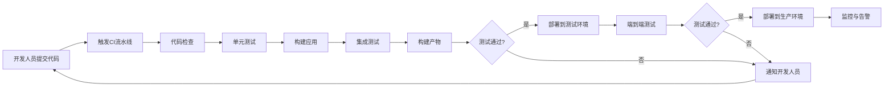

# 前端持续集成与部署实践（一）- CI/CD基础与构建优化

## 持续集成与部署概述

### 什么是CI/CD

CI/CD是现代软件开发的核心实践，包括：

1. **持续集成(Continuous Integration, CI)**：开发人员频繁地将代码集成到共享仓库，每次集成都通过自动构建和测试验证
2. **持续交付(Continuous Delivery)**：确保代码可以随时部署到生产环境
3. **持续部署(Continuous Deployment)**：自动将通过所有测试的代码部署到生产环境

### CI/CD的价值

1. **提高代码质量**：通过自动化测试和代码检查
2. **加速交付周期**：自动化构建和部署流程
3. **降低风险**：小步快跑，减少集成问题
4. **增强团队协作**：统一的开发流程和标准
5. **快速反馈**：及时发现问题并修复

### CI/CD流程图



## CI/CD工具选择

### 主流CI/CD平台对比

| 平台 | 优点 | 缺点 | 适用场景 |
|------|------|------|----------|
| GitHub Actions | 与GitHub深度集成，配置简单 | 执行器资源有限 | 开源项目，GitHub托管项目 |
| GitLab CI/CD | 功能全面，自托管选项 | 学习曲线较陡 | 企业级应用，需要自托管 |
| Jenkins | 高度可定制，插件丰富 | 配置复杂，维护成本高 | 复杂构建流程，企业环境 |
| CircleCI | 配置简单，执行速度快 | 免费额度有限 | 中小型项目，快速迭代 |
| Travis CI | 配置简单，与GitHub集成好 | 免费版功能有限 | 开源项目 |

### GitHub Actions详解

#### GitHub Actions基础概念

1. **工作流(Workflow)**：定义在`.github/workflows/`目录下的YAML文件
2. **事件(Event)**：触发工作流运行的活动，如push、pull request
3. **作业(Job)**：工作流中的执行单元
4. **步骤(Step)**：作业中的单个任务
5. **动作(Action)**：可重用的代码单元

#### GitHub Actions配置示例

```yaml
# .github/workflows/ci-cd.yml
name: CI/CD Pipeline

# 触发条件
on:
  push:
    branches: [ main, develop ]
  pull_request:
    branches: [ main ]

# 环境变量
env:
  NODE_VERSION: '16'
  CACHE_VERSION: 'v1'

# 工作流
jobs:
  # 代码检查和测试
  test:
    name: Test
    runs-on: ubuntu-latest
    
    # 缓存依赖
    strategy:
      matrix:
        node-version: [14, 16, 18]
    
    steps:
    - name: Checkout code
      uses: actions/checkout@v3
    
    - name: Setup Node.js ${{ matrix.node-version }}
      uses: actions/setup-node@v3
      with:
        node-version: ${{ matrix.node-version }}
        cache: 'npm'
    
    - name: Install dependencies
      run: npm ci
    
    - name: Run linter
      run: npm run lint
    
    - name: Run type check
      run: npm run type-check
    
    - name: Run unit tests
      run: npm run test:unit
    
    - name: Run integration tests
      run: npm run test:integration
    
    - name: Upload coverage reports
      uses: codecov/codecov-action@v3
      with:
        file: ./coverage/lcov.info
        flags: unittests
        name: codecov-umbrella
  
  # 构建应用
  build:
    name: Build
    runs-on: ubuntu-latest
    needs: test
    
    steps:
    - name: Checkout code
      uses: actions/checkout@v3
    
    - name: Setup Node.js
      uses: actions/setup-node@v3
      with:
        node-version: ${{ env.NODE_VERSION }}
        cache: 'npm'
    
    - name: Install dependencies
      run: npm ci
    
    - name: Build application
      run: npm run build
    
    - name: Upload build artifacts
      uses: actions/upload-artifact@v3
      with:
        name: build-files
        path: dist/
        retention-days: 7
  
  # 部署到测试环境
  deploy-staging:
    name: Deploy to Staging
    runs-on: ubuntu-latest
    needs: build
    if: github.ref == 'refs/heads/develop'
    environment: staging
    
    steps:
    - name: Checkout code
      uses: actions/checkout@v3
    
    - name: Download build artifacts
      uses: actions/download-artifact@v3
      with:
        name: build-files
        path: dist/
    
    - name: Deploy to staging
      uses: peaceiris/actions-gh-pages@v3
      with:
        github_token: ${{ secrets.GITHUB_TOKEN }}
        publish_dir: ./dist
        destination_dir: staging
    
    - name: Run E2E tests
      run: npm run test:e2e:staging
  
  # 部署到生产环境
  deploy-production:
    name: Deploy to Production
    runs-on: ubuntu-latest
    needs: build
    if: github.ref == 'refs/heads/main'
    environment: production
    
    steps:
    - name: Checkout code
      uses: actions/checkout@v3
    
    - name: Download build artifacts
      uses: actions/download-artifact@v3
      with:
        name: build-files
        path: dist/
    
    - name: Deploy to production
      uses: peaceiris/actions-gh-pages@v3
      with:
        github_token: ${{ secrets.GITHUB_TOKEN }}
        publish_dir: ./dist
        destination_dir: .
    
    - name: Notify deployment
      uses: 8398a7/action-slack@v3
      with:
        status: ${{ job.status }}
        channel: '#deployments'
        webhook_url: ${{ secrets.SLACK_WEBHOOK }}
```

#### 自定义GitHub Actions

```yaml
# .github/workflows/custom-action.yml
name: Custom Action Demo

on:
  push:
    branches: [ main ]

jobs:
  use-custom-action:
    runs-on: ubuntu-latest
    steps:
    - name: Checkout code
      uses: actions/checkout@v3
    
    - name: Use custom action
      uses: ./.github/actions/custom-action
      with:
        input-parameter: 'hello-world'
```

```yaml
# .github/actions/custom-action/action.yml
name: 'Custom Action'
description: 'A custom action for demonstration'
inputs:
  input-parameter:
    description: 'An input parameter'
    required: true
    default: 'default-value'
outputs:
  output-parameter:
    description: 'An output parameter'
    value: ${{ steps.step1.outputs.output }}
runs:
  using: 'composite'
  steps:
    - name: Step 1
      id: step1
      shell: bash
      run: |
        echo "Processing input: ${{ inputs.input-parameter }}"
        echo "::set-output name=output::processed-${{ inputs.input-parameter }}"
    
    - name: Step 2
      shell: bash
      run: |
        echo "Output from step 1: ${{ steps.step1.outputs.output }}"
```

## 构建优化策略

### 构建性能优化

#### 依赖缓存

```yaml
# GitHub Actions中的依赖缓存示例
- name: Cache node modules
  uses: actions/cache@v3
  with:
    path: |
      ~/.npm
      node_modules
    key: ${{ runner.os }}-node-${{ env.CACHE_VERSION }}-${{ hashFiles('**/package-lock.json') }}
    restore-keys: |
      ${{ runner.os }}-node-${{ env.CACHE_VERSION }}-
      ${{ runner.os }}-node-
```

#### 并行构建

```yaml
# 并行执行测试
jobs:
  test:
    runs-on: ubuntu-latest
    strategy:
      matrix:
        # 并行运行不同类型的测试
        test-type: [unit, integration, e2e]
        # 并行运行不同浏览器测试
        browser: [chrome, firefox, safari]
        exclude:
          # 排除某些组合
          - test-type: unit
            browser: safari
    
    steps:
    - name: Run ${{ matrix.test-type }} tests on ${{ matrix.browser }}
      run: npm run test:${{ matrix.test-type }}:${{ matrix.browser }}
```

#### 增量构建

```javascript
// webpack.config.js
module.exports = {
  // 启用缓存
  cache: {
    type: 'filesystem',
    buildDependencies: {
      config: [__filename]
    }
  },
  
  // 代码分割
  optimization: {
    splitChunks: {
      chunks: 'all',
      cacheGroups: {
        vendor: {
          test: /[\\/]node_modules[\\/]/,
          name: 'vendors',
          chunks: 'all'
        }
      }
    }
  }
};
```

### 构建产物优化

#### 代码压缩与优化

```javascript
// webpack.prod.js
const TerserPlugin = require('terser-webpack-plugin');
const CssMinimizerPlugin = require('css-minimizer-webpack-plugin');

module.exports = {
  optimization: {
    minimize: true,
    minimizer: [
      new TerserPlugin({
        parallel: true,
        terserOptions: {
          compress: {
            drop_console: true, // 移除console
            drop_debugger: true, // 移除debugger
            pure_funcs: ['console.log'] // 移除特定函数调用
          }
        }
      }),
      new CssMinimizerPlugin()
    ]
  }
};
```

#### 资源优化

```javascript
// 图片优化
const ImageMinimizerPlugin = require('image-minimizer-webpack-plugin');

module.exports = {
  plugins: [
    new ImageMinimizerPlugin({
      minimizer: {
        implementation: ImageMinimizerPlugin.imageminMinify,
        options: {
          plugins: [
            ['gifsicle', { optimizationLevel: 7 }],
            ['mozjpeg', { quality: 80 }],
            ['pngquant', { quality: [0.65, 0.8] }],
            ['svgo', { plugins: [{ name: 'removeViewBox', active: false }] }]
          ]
        }
      }
    })
  ]
};
```

#### 代码分割与懒加载

```javascript
// 路由级别的代码分割
import { lazy, Suspense } from 'react';
import { Routes, Route } from 'react-router-dom';

const Home = lazy(() => import('./pages/Home'));
const Products = lazy(() => import('./pages/Products'));
const About = lazy(() => import('./pages/About'));

function App() {
  return (
    <Suspense fallback={<div>Loading...</div>}>
      <Routes>
        <Route path="/" element={<Home />} />
        <Route path="/products" element={<Products />} />
        <Route path="/about" element={<About />} />
      </Routes>
    </Suspense>
  );
}

// 组件级别的懒加载
const LazyComponent = lazy(() => 
  import('./components/HeavyComponent').then(module => ({
    default: module.HeavyComponent
  }))
);
```

#### Tree Shaking优化

```javascript
// webpack.config.js
module.exports = {
  mode: 'production',
  optimization: {
    usedExports: true,
    sideEffects: false,
    minimize: true
  }
};

// package.json
{
  "sideEffects": [
    "*.css",
    "*.scss",
    "./src/styles/**"
  ]
}
```

## 构建环境管理

### 环境配置

```javascript
// config/environments.js
const environments = {
  development: {
    apiUrl: 'http://localhost:3001/api',
    logLevel: 'debug',
    enableMockData: true
  },
  staging: {
    apiUrl: 'https://staging-api.example.com/api',
    logLevel: 'info',
    enableMockData: false
  },
  production: {
    apiUrl: 'https://api.example.com/api',
    logLevel: 'error',
    enableMockData: false
  }
};

const currentEnv = process.env.NODE_ENV || 'development';
module.exports = environments[currentEnv];
```

### 环境变量管理

```yaml
# GitHub Actions中的环境变量
- name: Setup environment variables
  run: |
    echo "API_URL=${{ secrets.API_URL }}" >> .env.production
    echo "API_KEY=${{ secrets.API_KEY }}" >> .env.production
    echo "SENTRY_DSN=${{ secrets.SENTRY_DSN }}" >> .env.production
```

## 构建安全

### 依赖安全扫描

```yaml
# npm audit
- name: Run npm audit
  run: npm audit --audit-level moderate

# Snyk安全扫描
- name: Run Snyk security scan
  uses: snyk/actions/node@master
  env:
    SNYK_TOKEN: ${{ secrets.SNYK_TOKEN }}
  with:
    args: --severity-threshold=high
```

### 代码安全检查

```yaml
# CodeQL分析
- name: Initialize CodeQL
  uses: github/codeql-action/init@v2
  with:
    languages: javascript

- name: Perform CodeQL Analysis
  uses: github/codeql-action/analyze@v2
```

## 总结

前端持续集成与构建优化是现代前端工程化的基础，通过合理的CI/CD配置和构建优化策略，我们可以：

1. **提高构建效率**：通过缓存、并行构建和增量构建减少构建时间
2. **优化构建产物**：通过代码压缩、资源优化和Tree Shaking减少产物体积
3. **保证构建安全**：通过依赖扫描和代码检查发现潜在安全问题
4. **管理构建环境**：通过环境配置和环境变量管理不同环境的构建需求

有效的CI/CD基础应该：
- 选择适合项目需求的CI/CD平台和工具
- 设计合理的构建流程和检查点
- 实施适当的构建优化策略
- 建立完善的安全检查机制
- 持续监控和优化构建性能

通过持续实践和改进，团队可以建立起高效、可靠的CI/CD基础，为后续的部署和监控提供坚实保障。在下一篇文章中，我们将继续探讨部署策略与监控实践。