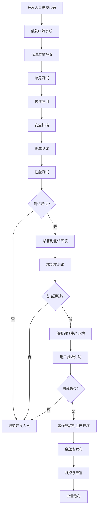

# 前端持续集成与部署实践（二）- 部署策略与监控实践

## 部署策略

### 环境管理

#### 环境配置

```javascript
// config/environments.js
const environments = {
  development: {
    apiUrl: 'http://localhost:3001/api',
    logLevel: 'debug',
    enableMockData: true
  },
  staging: {
    apiUrl: 'https://staging-api.example.com/api',
    logLevel: 'info',
    enableMockData: false
  },
  production: {
    apiUrl: 'https://api.example.com/api',
    logLevel: 'error',
    enableMockData: false
  }
};

const currentEnv = process.env.NODE_ENV || 'development';
module.exports = environments[currentEnv];
```

#### 环境变量管理

```yaml
# GitHub Actions中的环境变量
- name: Setup environment variables
  run: |
    echo "API_URL=${{ secrets.API_URL }}" >> .env.production
    echo "API_KEY=${{ secrets.API_KEY }}" >> .env.production
    echo "SENTRY_DSN=${{ secrets.SENTRY_DSN }}" >> .env.production
```

### 部署模式

#### 蓝绿部署

```yaml
# 蓝绿部署配置
- name: Blue-Green Deployment
  run: |
    # 获取当前活跃环境
    CURRENT_ENV=$(curl -s https://api.example.com/status | jq -r '.environment')
    
    # 切换到非活跃环境
    if [ "$CURRENT_ENV" = "blue" ]; then
      TARGET_ENV="green"
    else
      TARGET_ENV="blue"
    fi
    
    # 部署到目标环境
    aws s3 sync dist/ s3://my-app-$TARGET_ENV --delete
    aws cloudfront create-invalidation --distribution-id ${{ secrets.CLOUDFRONT_DISTRIBUTION_ID }} --paths "/*"
    
    # 健康检查
    for i in {1..10}; do
      if curl -f https://$TARGET_ENV.example.com/health; then
        echo "Health check passed for $TARGET_ENV"
        break
      else
        echo "Health check failed for $TARGET_ENV, retrying..."
        sleep 30
      fi
    done
    
    # 切换流量
    aws route53 change-resource-record-sets --hosted-zone-id ${{ secrets.HOSTED_ZONE_ID }} --change-batch file://route53-change.json
```

#### 滚动更新

```yaml
# 滚动更新配置
- name: Rolling Update
  run: |
    # 获取当前实例列表
    INSTANCES=$(aws ec2 describe-instances --filters "Name=tag:Environment,Values=production" "Name=instance-state-name,Values=running" --query "Reservations[].Instances[].InstanceId" --output text)
    
    # 分批更新
    BATCH_SIZE=2
    BATCHES=$(echo $INSTANCES | tr ' ' '\n' | wc -l | awk '{print int($1/'$BATCH_SIZE')+1}')
    
    for BATCH in $(seq 1 $BATCHES); do
      echo "Updating batch $BATCH/$BATCHES"
      
      # 获取当前批次的实例
      BATCH_INSTANCES=$(echo $INSTANCES | tr ' ' '\n' | sed -n "$(($BATCH*$BATCH_SIZE-$BATCH_SIZE+1)),$(($BATCH*$BATCH_SIZE))p")
      
      # 从负载均衡器中移除当前批次
      for INSTANCE in $BATCH_INSTANCES; do
        aws elbv2 deregister-targets --target-group-arn ${{ secrets.TARGET_GROUP_ARN }} --targets Id=$INSTANCE
      done
      
      # 等待连接排空
      sleep 60
      
      # 更新应用
      for INSTANCE in $BATCH_INSTANCES; do
        aws ssm send-command --instance-ids $INSTANCE --document-name "AWS-RunShellScript" --parameters 'commands=["cd /var/www/html && git pull origin main && npm install && npm run build"]'
      done
      
      # 等待更新完成
      sleep 120
      
      # 健康检查并重新加入负载均衡器
      for INSTANCE in $BATCH_INSTANCES; do
        # 等待实例健康
        for i in {1..10}; do
          if curl -f http://$(aws ec2 describe-instances --instance-ids $INSTANCE --query "Reservations[].Instances[].PublicIpAddress" --output text)/health; then
            echo "Instance $INSTANCE is healthy"
            aws elbv2 register-targets --target-group-arn ${{ secrets.TARGET_GROUP_ARN }} --targets Id=$INSTANCE
            break
          else
            echo "Instance $INSTANCE is not healthy, retrying..."
            sleep 30
          fi
        done
      done
    done
```

#### 金丝雀发布

```yaml
# 金丝雀发布配置
- name: Canary Deployment
  run: |
    # 部署金丝雀版本
    aws s3 sync dist/ s3://my-app-canary --delete
    
    # 创建CloudFront分发用于金丝雀
    CANARY_DISTRIBUTION_ID=$(aws cloudfront create-distribution --distribution-config file://canary-config.json --query 'Distribution.Id' --output text)
    
    # 配置权重路由
    cat > lambda-edge-function.js << EOF
    exports.handler = (event, context, callback) => {
      const request = event.Records[0].cf.request;
      const headers = request.headers;
      
      // 检查是否有金丝雀测试标记
      if (headers.cookie && headers.cookie[0].value.includes('canary=true')) {
        // 重定向到金丝雀环境
        request.origin = {
          custom: {
            domainName: 'my-app-canary.s3.amazonaws.com',
            port: 443,
            protocol: 'https',
            readTimeout: 10,
            keepaliveTimeout: 5,
            sslProtocols: ['TLSv1.2']
          }
        };
        request.headers['host'] = [{ key: 'host', value: 'my-app-canary.s3.amazonaws.com' }];
      }
      
      callback(null, request);
    };
    EOF
    
    # 部署Lambda@Edge函数
    aws lambda publish-version --function-name canary-router --description "Canary routing version"
    
    # 逐步增加流量
    for WEIGHT in 5 10 25 50; do
      echo "Increasing canary traffic to $WEIGHT%"
      
      # 更新权重配置
      cat > weighted-config.json << EOF
    {
      "CallerReference": "canary-weight-$WEIGHT",
      "Comment": "Update canary traffic weight to $WEIGHT%",
      "Changes": [
        {
          "Action": "UPSERT",
          "ResourceRecordSet": {
            "Name": "my-app.example.com",
            "Type": "A",
            "AliasTarget": {
              "DNSName": "d1234567890.cloudfront.net",
              "EvaluateTargetHealth": false,
              "HostedZoneId": "Z2FDTNDATAQYW2"
            },
            "SetIdentifier": "primary",
            "Weight": $((100-$WEIGHT))
          }
        },
        {
          "Action": "UPSERT",
          "ResourceRecordSet": {
            "Name": "my-app.example.com",
            "Type": "A",
            "AliasTarget": {
              "DNSName": "$CANARY_DISTRIBUTION_ID.cloudfront.net",
              "EvaluateTargetHealth": false,
              "HostedZoneId": "Z2FDTNDATAQYW2"
            },
            "SetIdentifier": "canary",
            "Weight": $WEIGHT
          }
        }
      ]
    }
    EOF
      
      # 应用权重配置
      aws route53 change-resource-record-sets --hosted-zone-id ${{ secrets.HOSTED_ZONE_ID }} --change-batch file://weighted-config.json
      
      # 等待一段时间收集指标
      sleep 1800  # 30分钟
      
      # 检查金丝雀版本的健康状况
      ERROR_RATE=$(aws cloudwatch get-metric-statistics --namespace AWS/ApplicationELB --metric-name HTTPCode_Target_5XX_Count --dimensions Name=LoadBalancer,Value=app/canary --start-time $(date -u -v-30M +%Y-%m-%dT%H:%M:%SZ) --end-time $(date -u +%Y-%m-%dT%H:%M:%SZ) --period 300 --statistics Sum --query 'Datapoints[-1].Sum' --output text)
      
      if [ "$ERROR_RATE" -gt "10" ]; then
        echo "Error rate too high, rolling back canary deployment"
        # 回滚操作
        cat > rollback-config.json << EOF
    {
      "CallerReference": "canary-rollback",
      "Comment": "Rollback canary deployment",
      "Changes": [
        {
          "Action": "DELETE",
          "ResourceRecordSet": {
            "Name": "my-app.example.com",
            "Type": "A",
            "SetIdentifier": "canary"
          }
        }
      ]
    }
    EOF
        aws route53 change-resource-record-sets --hosted-zone-id ${{ secrets.HOSTED_ZONE_ID }} --change-batch file://rollback-config.json
        exit 1
      fi
    done
    
    # 金丝雀测试成功，完全切换到新版本
    echo "Canary deployment successful, fully switching to new version"
    aws s3 sync dist/ s3://my-app --delete
    aws cloudfront create-invalidation --distribution-id ${{ secrets.CLOUDFRONT_DISTRIBUTION_ID }} --paths "/*"
```

## 监控与告警

### 前端性能监控

#### Sentry集成

```javascript
// src/sentry.js
import * as Sentry from '@sentry/react';
import { Integrations } from '@sentry/tracing';

// 初始化Sentry
Sentry.init({
  dsn: process.env.REACT_APP_SENTRY_DSN,
  integrations: [
    new Integrations.BrowserTracing(),
  ],
  tracesSampleRate: 0.2, // 采样率
  environment: process.env.NODE_ENV,
  release: process.env.REACT_APP_VERSION,
  
  // 性能监控配置
  beforeSend(event) {
    // 过滤掉不需要的错误
    if (event.exception) {
      const error = event.exception.values[0];
      if (error.type === 'ResizeObserver loop limit exceeded') {
        return null; // 不发送这个特定错误
      }
    }
    return event;
  },
  
  // 自定义标签
  beforeBreadcrumb(breadcrumb) {
    if (breadcrumb.category === 'xhr') {
      // 记录API请求
      breadcrumb.data = {
        ...breadcrumb.data,
        url: breadcrumb.data.url.replace(/\/api\/[a-zA-Z0-9]+/, '/api/***') // 脱敏处理
      };
    }
    return breadcrumb;
  }
});

// 自定义性能指标
export const trackCustomMetric = (name, value, tags = {}) => {
  Sentry.addBreadcrumb({
    message: `Custom metric: ${name}`,
    level: 'info',
    data: {
      metricName: name,
      metricValue: value,
      tags
    }
  });
  
  // 发送到自定义后端
  fetch('/api/metrics', {
    method: 'POST',
    headers: {
      'Content-Type': 'application/json'
    },
    body: JSON.stringify({
      name,
      value,
      tags,
      timestamp: Date.now()
    })
  });
};

// 使用示例
export const trackPageLoadTime = () => {
  const navigation = performance.getEntriesByType('navigation')[0];
  const loadTime = navigation.loadEventEnd - navigation.fetchStart;
  
  trackCustomMetric('page_load_time', loadTime, {
    page: window.location.pathname
  });
  
  Sentry.setTag('page_load_time', loadTime);
};

export const trackAPIResponseTime = (url, duration) => {
  trackCustomMetric('api_response_time', duration, {
    endpoint: url
  });
};
```

#### 性能监控配置

```yaml
# GitHub Actions中的性能监控配置
- name: Performance Monitoring Setup
  run: |
    # 在构建过程中注入性能监控脚本
    cat > performance-monitor.js << EOF
    // 性能监控脚本
    (function() {
      // 监控页面加载时间
      window.addEventListener('load', function() {
        setTimeout(function() {
          const perfData = performance.getEntriesByType('navigation')[0];
          const pageLoadTime = perfData.loadEventEnd - perfData.fetchStart;
          
          // 发送性能数据
          fetch('/api/performance', {
            method: 'POST',
            headers: {
              'Content-Type': 'application/json'
            },
            body: JSON.stringify({
              metric: 'page_load_time',
              value: pageLoadTime,
              url: window.location.href,
              userAgent: navigator.userAgent,
              timestamp: Date.now()
            })
          });
        }, 0);
      });
      
      // 监控API请求时间
      const originalFetch = window.fetch;
      window.fetch = function(...args) {
        const startTime = performance.now();
        return originalFetch.apply(this, args).then(response => {
          const endTime = performance.now();
          const duration = endTime - startTime;
          
          // 只监控API请求
          if (args[0].includes('/api/')) {
            fetch('/api/performance', {
              method: 'POST',
              headers: {
                'Content-Type': 'application/json'
              },
              body: JSON.stringify({
                metric: 'api_response_time',
                value: duration,
                url: args[0],
                status: response.status,
                timestamp: Date.now()
              })
            });
          }
          
          return response;
        });
      };
    })();
    EOF
    
    # 将性能监控脚本注入到HTML中
    sed -i.bak "s|</head>|<script>$(cat performance-monitor.js)</script></head>|" dist/index.html
```

### 健康检查

```yaml
# 健康检查配置
- name: Health Check
  run: |
    # 部署后健康检查
    MAX_RETRIES=10
    RETRY_INTERVAL=30
    HEALTH_CHECK_URL="https://my-app.example.com/health"
    
    for i in $(seq 1 $MAX_RETRIES); do
      echo "Health check attempt $i/$MAX_RETRIES"
      
      # 检查HTTP状态码
      HTTP_STATUS=$(curl -s -o /dev/null -w "%{http_code}" $HEALTH_CHECK_URL)
      
      if [ "$HTTP_STATUS" = "200" ]; then
        echo "Health check passed"
        
        # 检查关键功能
        RESPONSE_BODY=$(curl -s $HEALTH_CHECK_URL)
        API_STATUS=$(echo $RESPONSE_BODY | jq -r '.api.status')
        DB_STATUS=$(echo $RESPONSE_BODY | jq -r '.database.status')
        
        if [ "$API_STATUS" = "ok" ] && [ "$DB_STATUS" = "ok" ]; then
          echo "All services are healthy"
          exit 0
        else
          echo "Some services are not healthy"
          echo "API Status: $API_STATUS"
          echo "Database Status: $DB_STATUS"
        fi
      else
        echo "Health check failed with HTTP status: $HTTP_STATUS"
      fi
      
      if [ $i -eq $MAX_RETRIES ]; then
        echo "Health check failed after $MAX_RETRIES attempts"
        exit 1
      fi
      
      echo "Retrying in $RETRY_INTERVAL seconds..."
      sleep $RETRY_INTERVAL
    done
```

### 告警通知

#### Slack通知

```yaml
# Slack通知配置
- name: Slack Notification
  if: always() # 无论成功或失败都发送通知
  uses: 8398a7/action-slack@v3
  with:
    status: ${{ job.status }}
    channel: '#deployments'
    text: |
      Deployment ${{ job.status }} for ${{ github.repository }}
      Branch: ${{ github.ref }}
      Commit: ${{ github.sha }}
      Author: ${{ github.actor }}
    webhook_url: ${{ secrets.SLACK_WEBHOOK }}
```

#### 邮件通知

```yaml
# 邮件通知配置
- name: Email Notification
  if: failure() # 仅在失败时发送邮件
  uses: dawidd6/action-send-mail@v3
  with:
    server_address: smtp.gmail.com
    server_port: 587
    username: ${{ secrets.EMAIL_USERNAME }}
    password: ${{ secrets.EMAIL_PASSWORD }}
    subject: "Deployment Failed: ${{ github.repository }}"
    body: |
      The deployment for ${{ github.repository }} failed.
      
      Branch: ${{ github.ref }}
      Commit: ${{ github.sha }}
      Author: ${{ github.actor }}
      
      Please check the GitHub Actions logs for more details.
    to: ${{ secrets.NOTIFICATION_EMAIL }}
    from: GitHub Actions
```

## 实际应用案例

### 大型电商平台CI/CD流程



### 完整CI/CD配置

```yaml
# .github/workflows/ecommerce-pipeline.yml
name: E-commerce CI/CD Pipeline

on:
  push:
    branches: [ main, develop ]
  pull_request:
    branches: [ main ]

env:
  REGISTRY: ghcr.io
  IMAGE_NAME: ${{ github.repository }}

jobs:
  # 代码质量检查
  code-quality:
    name: Code Quality
    runs-on: ubuntu-latest
    
    steps:
    - name: Checkout code
      uses: actions/checkout@v3
    
    - name: Setup Node.js
      uses: actions/setup-node@v3
      with:
        node-version: '16'
        cache: 'npm'
    
    - name: Install dependencies
      run: npm ci
    
    - name: Run ESLint
      run: npm run lint
    
    - name: Run Prettier check
      run: npm run format:check
    
    - name: Run TypeScript check
      run: npm run type-check
    
    - name: Run accessibility tests
      run: npm run test:a11y
  
  # 安全扫描
  security-scan:
    name: Security Scan
    runs-on: ubuntu-latest
    
    steps:
    - name: Checkout code
      uses: actions/checkout@v3
    
    - name: Setup Node.js
      uses: actions/setup-node@v3
      with:
        node-version: '16'
        cache: 'npm'
    
    - name: Install dependencies
      run: npm ci
    
    - name: Run npm audit
      run: npm audit --audit-level moderate
    
    - name: Run Snyk security scan
      uses: snyk/actions/node@master
      env:
        SNYK_TOKEN: ${{ secrets.SNYK_TOKEN }}
      with:
        args: --severity-threshold=high
    
    - name: Run CodeQL Analysis
      uses: github/codeql-action/analyze@v2
      with:
        languages: javascript
  
  # 单元测试
  unit-tests:
    name: Unit Tests
    runs-on: ubuntu-latest
    
    steps:
    - name: Checkout code
      uses: actions/checkout@v3
    
    - name: Setup Node.js
      uses: actions/setup-node@v3
      with:
        node-version: '16'
        cache: 'npm'
    
    - name: Install dependencies
      run: npm ci
    
    - name: Run unit tests
      run: npm run test:unit:coverage
    
    - name: Upload coverage to Codecov
      uses: codecov/codecov-action@v3
      with:
        file: ./coverage/lcov.info
        flags: unittests
        name: codecov-umbrella
  
  # 构建Docker镜像
  build-image:
    name: Build Docker Image
    runs-on: ubuntu-latest
    needs: [code-quality, security-scan, unit-tests]
    if: github.ref == 'refs/heads/main' || github.ref == 'refs/heads/develop'
    
    steps:
    - name: Checkout code
      uses: actions/checkout@v3
    
    - name: Log in to Container Registry
      uses: docker/login-action@v2
      with:
        registry: ${{ env.REGISTRY }}
        username: ${{ github.actor }}
        password: ${{ secrets.GITHUB_TOKEN }}
    
    - name: Extract metadata
      id: meta
      uses: docker/metadata-action@v4
      with:
        images: ${{ env.REGISTRY }}/${{ env.IMAGE_NAME }}
        tags: |
          type=ref,event=branch
          type=ref,event=pr
          type=sha,prefix={{branch}}-
    
    - name: Build and push Docker image
      uses: docker/build-push-action@v4
      with:
        context: .
        push: true
        tags: ${{ steps.meta.outputs.tags }}
        labels: ${{ steps.meta.outputs.labels }}
        cache-from: type=gha
        cache-to: type=gha,mode=max
  
  # 部署到测试环境
  deploy-staging:
    name: Deploy to Staging
    runs-on: ubuntu-latest
    needs: build-image
    if: github.ref == 'refs/heads/develop'
    environment: staging
    
    steps:
    - name: Checkout code
      uses: actions/checkout@v3
    
    - name: Deploy to staging
      run: |
        echo "Deploying to staging environment"
        # 这里可以添加实际的部署脚本
        
    - name: Run integration tests
      run: |
        echo "Running integration tests"
        npm run test:integration
    
    - name: Run performance tests
      run: |
        echo "Running performance tests"
        npm run test:performance
  
  # 部署到预生产环境
  deploy-preprod:
    name: Deploy to Pre-production
    runs-on: ubuntu-latest
    needs: build-image
    if: github.ref == 'refs/heads/main'
    environment: pre-production
    
    steps:
    - name: Checkout code
      uses: actions/checkout@v3
    
    - name: Deploy to pre-production
      run: |
        echo "Deploying to pre-production environment"
        # 这里可以添加实际的部署脚本
    
    - name: Run end-to-end tests
      run: |
        echo "Running end-to-end tests"
        npm run test:e2e
    
    - name: Run visual regression tests
      run: |
        echo "Running visual regression tests"
        npm run test:visual
  
  # 蓝绿部署到生产环境
  deploy-prod-blue-green:
    name: Blue-Green Deployment to Production
    runs-on: ubuntu-latest
    needs: deploy-preprod
    if: github.ref == 'refs/heads/main'
    environment: production
    
    steps:
    - name: Checkout code
      uses: actions/checkout@v3
    
    - name: Deploy to production (Blue-Green)
      run: |
        echo "Performing blue-green deployment to production"
        # 这里可以添加实际的蓝绿部署脚本
        
    - name: Health check
      run: |
        echo "Performing health check"
        # 这里可以添加健康检查脚本
        
    - name: Switch traffic
      run: |
        echo "Switching traffic to new version"
        # 这里可以添加流量切换脚本
        
    - name: Post-deployment tests
      run: |
        echo "Running post-deployment tests"
        # 这里可以添加部署后测试脚本
        
    - name: Notify deployment
      uses: 8398a7/action-slack@v3
      with:
        status: ${{ job.status }}
        channel: '#deployments'
        webhook_url: ${{ secrets.SLACK_WEBHOOK }}
```

### 监控与告警配置

```yaml
# monitoring/prometheus.yml
global:
  scrape_interval: 15s
  evaluation_interval: 15s

rule_files:
  - "alert_rules.yml"

scrape_configs:
  - job_name: 'frontend'
    static_configs:
      - targets: ['app:3000']
    metrics_path: '/metrics'
    scrape_interval: 30s

alerting:
  alertmanagers:
    - static_configs:
        - targets:
          - alertmanager:9093

# monitoring/alert_rules.yml
groups:
  - name: frontend_alerts
    rules:
      - alert: HighErrorRate
        expr: rate(http_requests_total{status=~"5.."}[5m]) > 0.1
        for: 5m
        labels:
          severity: critical
        annotations:
          summary: "High error rate detected"
          description: "Error rate is {{ $value }} errors per second"
      
      - alert: HighResponseTime
        expr: histogram_quantile(0.95, rate(http_request_duration_seconds_bucket[5m])) > 0.5
        for: 5m
        labels:
          severity: warning
        annotations:
          summary: "High response time detected"
          description: "95th percentile response time is {{ $value }} seconds"
      
      - alert: LowThroughput
        expr: rate(http_requests_total[5m]) < 0.1
        for: 10m
        labels:
          severity: warning
        annotations:
          summary: "Low throughput detected"
          description: "Request rate is {{ $value }} requests per second"
```

```yaml
# monitoring/grafana-dashboard.json
{
  "dashboard": {
    "title": "Frontend Performance Dashboard",
    "panels": [
      {
        "title": "Request Rate",
        "type": "graph",
        "targets": [
          {
            "expr": "rate(http_requests_total[5m])",
            "legendFormat": "{{method}} {{status}}"
          }
        ]
      },
      {
        "title": "Response Time",
        "type": "graph",
        "targets": [
          {
            "expr": "histogram_quantile(0.95, rate(http_request_duration_seconds_bucket[5m]))",
            "legendFormat": "95th percentile"
          },
          {
            "expr": "histogram_quantile(0.50, rate(http_request_duration_seconds_bucket[5m]))",
            "legendFormat": "50th percentile"
          }
        ]
      },
      {
        "title": "Error Rate",
        "type": "graph",
        "targets": [
          {
            "expr": "rate(http_requests_total{status=~\"5..\"}[5m])",
            "legendFormat": "5xx errors"
          }
        ]
      }
    ]
  }
}
```

## 总结

前端持续集成与部署是现代前端工程化的核心实践，通过合理的部署策略和完善的监控告警系统，我们可以：

1. **提高部署可靠性**：通过蓝绿部署、滚动更新和金丝雀发布降低部署风险
2. **确保应用质量**：通过全面的测试和监控保证应用稳定性
3. **快速发现问题**：通过实时监控和告警及时响应问题
4. **优化用户体验**：通过性能监控和优化提升用户体验

有效的CI/CD实践应该：
- 选择适合项目需求的部署策略
- 建立完善的监控告警系统
- 实施全面的测试策略
- 持续优化部署流程
- 建立快速响应机制

通过持续实践和改进，团队可以建立起高效、可靠的CI/CD流程，为快速迭代和高质量交付提供坚实保障。前端CI/CD不仅是一种技术实践，更是一种团队协作和工程文化的体现，需要整个团队的共同努力和持续改进。