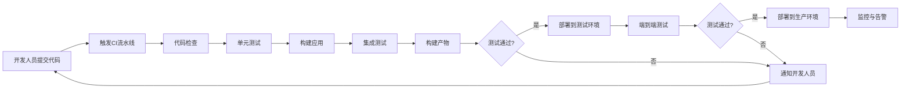
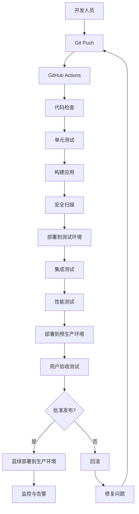

# 前端持续集成与部署实践

## 持续集成与部署概述

### 什么是CI/CD

CI/CD是现代软件开发的核心实践，包括：

1. **持续集成(Continuous Integration, CI)**：开发人员频繁地将代码集成到共享仓库，每次集成都通过自动构建和测试验证
2. **持续交付(Continuous Delivery)**：确保代码可以随时部署到生产环境
3. **持续部署(Continuous Deployment)**：自动将通过所有测试的代码部署到生产环境

### CI/CD的价值

1. **提高代码质量**：通过自动化测试和代码检查
2. **加速交付周期**：自动化构建和部署流程
3. **降低风险**：小步快跑，减少集成问题
4. **增强团队协作**：统一的开发流程和标准
5. **快速反馈**：及时发现问题并修复

### CI/CD流程图



## CI/CD工具选择

### 主流CI/CD平台对比

| 平台 | 优点 | 缺点 | 适用场景 |
|------|------|------|----------|
| GitHub Actions | 与GitHub深度集成，配置简单 | 执行器资源有限 | 开源项目，GitHub托管项目 |
| GitLab CI/CD | 功能全面，自托管选项 | 学习曲线较陡 | 企业级应用，需要自托管 |
| Jenkins | 高度可定制，插件丰富 | 配置复杂，维护成本高 | 复杂构建流程，企业环境 |
| CircleCI | 配置简单，执行速度快 | 免费额度有限 | 中小型项目，快速迭代 |
| Travis CI | 配置简单，与GitHub集成好 | 免费版功能有限 | 开源项目 |

### GitHub Actions详解

#### GitHub Actions基础概念

1. **工作流(Workflow)**：定义在`.github/workflows/`目录下的YAML文件
2. **事件(Event)**：触发工作流运行的活动，如push、pull request
3. **作业(Job)**：工作流中的执行单元
4. **步骤(Step)**：作业中的单个任务
5. **动作(Action)**：可重用的代码单元

#### GitHub Actions配置示例

```yaml
# .github/workflows/ci-cd.yml
name: CI/CD Pipeline

# 触发条件
on:
  push:
    branches: [ main, develop ]
  pull_request:
    branches: [ main ]

# 环境变量
env:
  NODE_VERSION: '16'
  CACHE_VERSION: 'v1'

# 工作流
jobs:
  # 代码检查和测试
  test:
    name: Test
    runs-on: ubuntu-latest
    
    # 缓存依赖
    strategy:
      matrix:
        node-version: [14, 16, 18]
    
    steps:
    - name: Checkout code
      uses: actions/checkout@v3
    
    - name: Setup Node.js ${{ matrix.node-version }}
      uses: actions/setup-node@v3
      with:
        node-version: ${{ matrix.node-version }}
        cache: 'npm'
    
    - name: Install dependencies
      run: npm ci
    
    - name: Run linter
      run: npm run lint
    
    - name: Run type check
      run: npm run type-check
    
    - name: Run unit tests
      run: npm run test:unit
    
    - name: Run integration tests
      run: npm run test:integration
    
    - name: Upload coverage reports
      uses: codecov/codecov-action@v3
      with:
        file: ./coverage/lcov.info
        flags: unittests
        name: codecov-umbrella
  
  # 构建应用
  build:
    name: Build
    runs-on: ubuntu-latest
    needs: test
    
    steps:
    - name: Checkout code
      uses: actions/checkout@v3
    
    - name: Setup Node.js
      uses: actions/setup-node@v3
      with:
        node-version: ${{ env.NODE_VERSION }}
        cache: 'npm'
    
    - name: Install dependencies
      run: npm ci
    
    - name: Build application
      run: npm run build
    
    - name: Upload build artifacts
      uses: actions/upload-artifact@v3
      with:
        name: build-files
        path: dist/
        retention-days: 7
  
  # 部署到测试环境
  deploy-staging:
    name: Deploy to Staging
    runs-on: ubuntu-latest
    needs: build
    if: github.ref == 'refs/heads/develop'
    environment: staging
    
    steps:
    - name: Checkout code
      uses: actions/checkout@v3
    
    - name: Download build artifacts
      uses: actions/download-artifact@v3
      with:
        name: build-files
        path: dist/
    
    - name: Deploy to staging
      uses: peaceiris/actions-gh-pages@v3
      with:
        github_token: ${{ secrets.GITHUB_TOKEN }}
        publish_dir: ./dist
        destination_dir: staging
    
    - name: Run E2E tests
      run: npm run test:e2e:staging
  
  # 部署到生产环境
  deploy-production:
    name: Deploy to Production
    runs-on: ubuntu-latest
    needs: build
    if: github.ref == 'refs/heads/main'
    environment: production
    
    steps:
    - name: Checkout code
      uses: actions/checkout@v3
    
    - name: Download build artifacts
      uses: actions/download-artifact@v3
      with:
        name: build-files
        path: dist/
    
    - name: Deploy to production
      uses: peaceiris/actions-gh-pages@v3
      with:
        github_token: ${{ secrets.GITHUB_TOKEN }}
        publish_dir: ./dist
        destination_dir: .
    
    - name: Notify deployment
      uses: 8398a7/action-slack@v3
      with:
        status: ${{ job.status }}
        channel: '#deployments'
        webhook_url: ${{ secrets.SLACK_WEBHOOK }}
```

#### 自定义GitHub Actions

```yaml
# .github/workflows/custom-action.yml
name: Custom Action Demo

on:
  push:
    branches: [ main ]

jobs:
  use-custom-action:
    runs-on: ubuntu-latest
    steps:
    - name: Checkout code
      uses: actions/checkout@v3
    
    - name: Use custom action
      uses: ./.github/actions/custom-action
      with:
        input-parameter: 'hello-world'
```

```yaml
# .github/actions/custom-action/action.yml
name: 'Custom Action'
description: 'A custom action for demonstration'
inputs:
  input-parameter:
    description: 'An input parameter'
    required: true
    default: 'default-value'
outputs:
  output-parameter:
    description: 'An output parameter'
    value: ${{ steps.step1.outputs.output }}
runs:
  using: 'composite'
  steps:
    - name: Step 1
      id: step1
      shell: bash
      run: |
        echo "Processing input: ${{ inputs.input-parameter }}"
        echo "::set-output name=output::processed-${{ inputs.input-parameter }}"
    
    - name: Step 2
      shell: bash
      run: |
        echo "Output from step 1: ${{ steps.step1.outputs.output }}"
```

## 构建优化策略

### 构建性能优化

#### 依赖缓存

```yaml
# GitHub Actions中的依赖缓存示例
- name: Cache node modules
  uses: actions/cache@v3
  with:
    path: |
      ~/.npm
      node_modules
    key: ${{ runner.os }}-node-${{ env.CACHE_VERSION }}-${{ hashFiles('**/package-lock.json') }}
    restore-keys: |
      ${{ runner.os }}-node-${{ env.CACHE_VERSION }}-
      ${{ runner.os }}-node-
```

#### 并行构建

```yaml
# 并行执行测试
jobs:
  test:
    runs-on: ubuntu-latest
    strategy:
      matrix:
        # 并行运行不同类型的测试
        test-type: [unit, integration, e2e]
        # 并行运行不同浏览器测试
        browser: [chrome, firefox, safari]
        exclude:
          # 排除某些组合
          - test-type: unit
            browser: safari
    
    steps:
    - name: Run ${{ matrix.test-type }} tests on ${{ matrix.browser }}
      run: npm run test:${{ matrix.test-type }}:${{ matrix.browser }}
```

#### 增量构建

```javascript
// webpack.config.js
module.exports = {
  // 启用缓存
  cache: {
    type: 'filesystem',
    buildDependencies: {
      config: [__filename]
    }
  },
  
  // 代码分割
  optimization: {
    splitChunks: {
      chunks: 'all',
      cacheGroups: {
        vendor: {
          test: /[\\/]node_modules[\\/]/,
          name: 'vendors',
          chunks: 'all'
        }
      }
    }
  }
};
```

### 构建产物优化

#### 代码压缩与优化

```javascript
// webpack.prod.js
const TerserPlugin = require('terser-webpack-plugin');
const CssMinimizerPlugin = require('css-minimizer-webpack-plugin');

module.exports = {
  optimization: {
    minimize: true,
    minimizer: [
      new TerserPlugin({
        parallel: true,
        terserOptions: {
          compress: {
            drop_console: true, // 移除console
            drop_debugger: true, // 移除debugger
            pure_funcs: ['console.log'] // 移除特定函数调用
          }
        }
      }),
      new CssMinimizerPlugin()
    ]
  }
};
```

#### 资源优化

```javascript
// 图片优化
const ImageMinimizerPlugin = require('image-minimizer-webpack-plugin');

module.exports = {
  plugins: [
    new ImageMinimizerPlugin({
      minimizer: {
        implementation: ImageMinimizerPlugin.imageminMinify,
        options: {
          plugins: [
            ['gifsicle', { optimizationLevel: 7 }],
            ['mozjpeg', { quality: 80 }],
            ['pngquant', { quality: [0.65, 0.8] }],
            ['svgo', { plugins: [{ name: 'removeViewBox', active: false }] }]
          ]
        }
      }
    })
  ]
};
```

## 部署策略

### 部署环境管理

#### 环境配置

```javascript
// config/environments.js
const environments = {
  development: {
    apiUrl: 'http://localhost:3001/api',
    logLevel: 'debug',
    enableMockData: true
  },
  staging: {
    apiUrl: 'https://staging-api.example.com/api',
    logLevel: 'info',
    enableMockData: false
  },
  production: {
    apiUrl: 'https://api.example.com/api',
    logLevel: 'error',
    enableMockData: false
  }
};

const currentEnv = process.env.NODE_ENV || 'development';
module.exports = environments[currentEnv];
```

#### 环境变量管理

```yaml
# GitHub Actions中的环境变量
- name: Setup environment variables
  run: |
    echo "API_URL=${{ secrets.API_URL }}" >> .env.production
    echo "API_KEY=${{ secrets.API_KEY }}" >> .env.production
    echo "SENTRY_DSN=${{ secrets.SENTRY_DSN }}" >> .env.production
```

### 部署策略类型

#### 蓝绿部署

蓝绿部署是通过维护两个相同的生产环境（蓝色和绿色）来实现零停机部署的策略。

```yaml
# 蓝绿部署示例
- name: Blue-Green Deployment
  run: |
    # 检查当前活跃环境
    CURRENT_ENV=$(curl -s https://api.example.com/health | jq -r '.environment')
    
    # 确定目标环境
    if [ "$CURRENT_ENV" = "blue" ]; then
      TARGET_ENV="green"
    else
      TARGET_ENV="blue"
    fi
    
    # 部署到目标环境
    echo "Deploying to $TARGET_ENV environment"
    scp -r dist/ user@${TARGET_ENV}.example.com:/var/www/html/
    
    # 健康检查
    curl -f https://${TARGET_ENV}.example.com/health || exit 1
    
    # 切换流量
    echo "Switching traffic to $TARGET_ENV"
    aws elbv2 modify-listener \
      --listener-arn ${{ secrets.LISTENER_ARN }} \
      --default-actions Type=forward,TargetGroupArn=${{ secrets.${TARGET_ENV}_TARGET_GROUP_ARN }}
    
    echo "Deployment to $TARGET_ENV completed successfully"
```

#### 滚动更新

滚动更新是逐步替换旧版本实例的部署策略。

```yaml
# 滚动更新示例
- name: Rolling Update
  run: |
    # 获取当前实例列表
    INSTANCES=$(aws ec2 describe-instances \
      --filters "Name=tag:Environment,Values=production" \
      --query "Reservations[*].Instances[*].InstanceId" \
      --output text)
    
    # 逐个更新实例
    for INSTANCE in $INSTANCES; do
      echo "Updating instance $INSTANCE"
      
      # 从负载均衡器中移除实例
      aws elbv2 deregister-targets \
        --target-group-arn ${{ secrets.TARGET_GROUP_ARN }} \
        --targets Id=$INSTANCE
      
      # 等待连接排空
      sleep 30
      
      # 部署新版本
      scp -r dist/ ec2-user@$INSTANCE:/var/www/html/
      
      # 健康检查
      ssh ec2-user@$INSTANCE "curl -f http://localhost/health" || exit 1
      
      # 重新加入负载均衡器
      aws elbv2 register-targets \
        --target-group-arn ${{ secrets.TARGET_GROUP_ARN }} \
        --targets Id=$INSTANCE
      
      echo "Instance $INSTANCE updated successfully"
    done
```

#### 金丝雀发布

金丝雀发布是将新版本先部署给一小部分用户，验证无误后再全量发布。

```yaml
# 金丝雀发布示例
- name: Canary Deployment
  run: |
    # 部署金丝雀版本
    echo "Deploying canary version"
    scp -r dist/ user@canary.example.com:/var/www/html/
    
    # 配置流量分配（10%到金丝雀版本）
    echo "Configuring traffic routing"
    aws apigatewayv2 update-route \
      --api-id ${{ secrets.API_ID }} \
      --route-id ${{ secrets.ROUTE_ID }} \
      --target "canary.example.com"
    
    # 设置权重
    aws apigatewayv2 update-stage \
      --api-id ${{ secrets.API_ID }} \
      --stage-name production \
      --route-settings '{"/": {"LoggingLevel": "INFO", "DataTraceEnabled": true}}'
    
    # 等待验证时间
    echo "Waiting for validation"
    sleep 300
    
    # 检查金丝雀版本指标
    ERROR_RATE=$(aws cloudwatch get-metric-statistics \
      --namespace AWS/ApiGateway \
      --metric-name 5XXError \
      --dimensions Name=ApiId,Value=${{ secrets.API_ID }} \
      --start-time $(date -u -v-10M +%Y-%m-%dT%H:%M:%SZ) \
      --end-time $(date -u +%Y-%m-%dT%H:%M:%SZ) \
      --period 60 \
      --statistics Average \
      --query Datapoints[0].Average)
    
    # 如果错误率低于阈值，继续全量发布
    if (( $(echo "$ERROR_RATE < 0.01" | bc -l) )); then
      echo "Canary validation passed, proceeding with full rollout"
      # 逐步增加流量
      for WEIGHT in 20 40 60 80 100; do
        echo "Increasing traffic to $WEIGHT%"
        aws apigatewayv2 update-stage \
          --api-id ${{ secrets.API_ID }} \
          --stage-name production \
          --default-route-settings "{\"ThrottlingBurstLimit\": 5000, \"ThrottlingRateLimit\": 10000, \"DetailedMetricsEnabled\": true, \"LoggingLevel\": \"INFO\", \"DataTraceEnabled\": true, \"CanarySettings\": { \"PercentTraffic\": $WEIGHT }}"
        sleep 60
      done
    else
      echo "Canary validation failed, rolling back"
      # 回滚到稳定版本
      aws apigatewayv2 update-route \
        --api-id ${{ secrets.API_ID }} \
        --route-id ${{ secrets.ROUTE_ID }} \
        --target "stable.example.com"
      exit 1
    fi
```

## 监控与告警

### 应用性能监控

#### 前端性能监控

```javascript
// 性能监控配置
import * as Sentry from '@sentry/react';
import { BrowserTracing } from '@sentry/tracing';

Sentry.init({
  dsn: process.env.REACT_APP_SENTRY_DSN,
  integrations: [
    new BrowserTracing({
      routingInstrumentation: Sentry.reactRouterV6Instrumentation(
        React.useEffect,
        useLocation,
        useNavigationType,
        createRoutesFromChildren,
        matchRoutes
      ),
    }),
  ],
  tracesSampleRate: 0.1,
  environment: process.env.NODE_ENV,
  release: `my-app@${process.env.REACT_APP_VERSION}`
});

// 自定义性能指标
const measurePerformance = (name, fn) => {
  const start = performance.now();
  const result = fn();
  const end = performance.now();
  Sentry.addBreadcrumb({
    message: `Performance: ${name}`,
    level: 'info',
    data: {
      duration: end - start
    }
  });
  return result;
};

// 使用示例
const fetchUserData = async (userId) => {
  return measurePerformance('fetchUserData', async () => {
    const response = await fetch(`/api/users/${userId}`);
    return response.json();
  });
};
```

#### 部署监控

```yaml
# 部署后健康检查
- name: Post-deployment health check
  run: |
    # 等待应用启动
    sleep 30
    
    # 检查健康端点
    for i in {1..10}; do
      if curl -f https://example.com/health; then
        echo "Health check passed"
        break
      else
        echo "Health check failed, retrying... ($i/10)"
        sleep 10
      fi
    done
    
    # 检查关键功能
    curl -f https://example.com/api/users || exit 1
    curl -f https://example.com/api/products || exit 1
    
    echo "All health checks passed"
```

### 告警配置

#### Slack通知

```yaml
# Slack通知配置
- name: Notify Slack on failure
  if: failure()
  uses: 8398a7/action-slack@v3
  with:
    status: failure
    channel: '#ci-cd'
    webhook_url: ${{ secrets.SLACK_WEBHOOK }}
    fields: repo,message,commit,author,action,eventName,ref,workflow

- name: Notify Slack on success
  if: success()
  uses: 8398a7/action-slack@v3
  with:
    status: success
    channel: '#ci-cd'
    webhook_url: ${{ secrets.SLACK_WEBHOOK }}
    text: 'Deployment to production completed successfully! 🎉'
```

#### 邮件通知

```yaml
# 邮件通知配置
- name: Send email notification
  if: always()
  uses: dawidd6/action-send-mail@v3
  with:
    server_address: smtp.gmail.com
    server_port: 587
    username: ${{ secrets.EMAIL_USERNAME }}
    password: ${{ secrets.EMAIL_PASSWORD }}
    subject: "Deployment ${{ job.status }}: ${{ github.repository }}"
    body: |
      Deployment Status: ${{ job.status }}
      Repository: ${{ github.repository }}
      Branch: ${{ github.ref }}
      Commit: ${{ github.sha }}
      Actor: ${{ github.actor }}
    to: ${{ secrets.NOTIFICATION_EMAIL }}
    from: GitHub Actions
```

## 实际应用案例

### 大型电商平台CI/CD流程

以下是一个大型电商平台的CI/CD实施案例：

#### 1. 整体架构



#### 2. CI/CD配置

```yaml
# .github/workflows/ecommerce-pipeline.yml
name: E-commerce CI/CD Pipeline

on:
  push:
    branches: [ main, develop, 'release/*' ]
  pull_request:
    branches: [ main ]

env:
  REGISTRY: ghcr.io
  IMAGE_NAME: ${{ github.repository }}

jobs:
  # 代码质量检查
  quality-check:
    name: Quality Check
    runs-on: ubuntu-latest
    
    steps:
    - name: Checkout code
      uses: actions/checkout@v3
    
    - name: Setup Node.js
      uses: actions/setup-node@v3
      with:
        node-version: '16'
        cache: 'npm'
    
    - name: Install dependencies
      run: npm ci
    
    - name: Run ESLint
      run: npm run lint
    
    - name: Run Prettier check
      run: npm run format:check
    
    - name: Run TypeScript check
      run: npm run type-check
    
    - name: Run unit tests
      run: npm run test:unit -- --coverage
    
    - name: Upload coverage to Codecov
      uses: codecov/codecov-action@v3
  
  # 安全扫描
  security-scan:
    name: Security Scan
    runs-on: ubuntu-latest
    needs: quality-check
    
    steps:
    - name: Checkout code
      uses: actions/checkout@v3
    
    - name: Run npm audit
      run: npm audit --audit-level moderate
    
    - name: Run Snyk security scan
      uses: snyk/actions/node@master
      env:
        SNYK_TOKEN: ${{ secrets.SNYK_TOKEN }}
      with:
        args: --severity-threshold=high
  
  # 构建Docker镜像
  build-image:
    name: Build Docker Image
    runs-on: ubuntu-latest
    needs: [quality-check, security-scan]
    if: github.event_name == 'push'
    
    outputs:
      image-digest: ${{ steps.build.outputs.digest }}
      image-tag: ${{ steps.meta.outputs.tags }}
    
    steps:
    - name: Checkout code
      uses: actions/checkout@v3
    
    - name: Set up Docker Buildx
      uses: docker/setup-buildx-action@v2
    
    - name: Log in to Container Registry
      uses: docker/login-action@v2
      with:
        registry: ${{ env.REGISTRY }}
        username: ${{ github.actor }}
        password: ${{ secrets.GITHUB_TOKEN }}
    
    - name: Extract metadata
      id: meta
      uses: docker/metadata-action@v4
      with:
        images: ${{ env.REGISTRY }}/${{ env.IMAGE_NAME }}
        tags: |
          type=ref,event=branch
          type=ref,event=pr
          type=sha,prefix={{branch}}-
          type=raw,value=latest,enable={{is_default_branch}}
    
    - name: Build and push Docker image
      id: build
      uses: docker/build-push-action@v4
      with:
        context: .
        push: true
        tags: ${{ steps.meta.outputs.tags }}
        labels: ${{ steps.meta.outputs.labels }}
        cache-from: type=gha
        cache-to: type=gha,mode=max
  
  # 部署到测试环境
  deploy-staging:
    name: Deploy to Staging
    runs-on: ubuntu-latest
    needs: build-image
    if: github.ref == 'refs/heads/develop'
    environment: staging
    
    steps:
    - name: Checkout code
      uses: actions/checkout@v3
    
    - name: Deploy to Kubernetes
      run: |
        echo "${{ secrets.KUBE_CONFIG }}" | base64 -d > kubeconfig
        export KUBECONFIG=kubeconfig
        
        # 更新镜像标签
        sed -i "s|image: .*|image: ${{ needs.build-image.outputs.image-tag }}|g" k8s/staging/deployment.yaml
        
        # 应用配置
        kubectl apply -f k8s/staging/
        
        # 等待部署完成
        kubectl rollout status deployment/ecommerce-staging -n staging
    
    - name: Run integration tests
      run: |
        npm run test:integration:staging
    
    - name: Run performance tests
      run: |
        npm run test:performance:staging
  
  # 部署到预生产环境
  deploy-preprod:
    name: Deploy to Pre-production
    runs-on: ubuntu-latest
    needs: build-image
    if: startsWith(github.ref, 'refs/heads/release/')
    environment: pre-production
    
    steps:
    - name: Checkout code
      uses: actions/checkout@v3
    
    - name: Deploy to Kubernetes
      run: |
        echo "${{ secrets.KUBE_CONFIG }}" | base64 -d > kubeconfig
        export KUBECONFIG=kubeconfig
        
        # 更新镜像标签
        sed -i "s|image: .*|image: ${{ needs.build-image.outputs.image-tag }}|g" k8s/preprod/deployment.yaml
        
        # 应用配置
        kubectl apply -f k8s/preprod/
        
        # 等待部署完成
        kubectl rollout status deployment/ecommerce-preprod -n preprod
    
    - name: Run E2E tests
      run: |
        npm run test:e2e:preprod
  
  # 部署到生产环境
  deploy-production:
    name: Deploy to Production
    runs-on: ubuntu-latest
    needs: build-image
    if: github.ref == 'refs/heads/main'
    environment: production
    
    steps:
    - name: Checkout code
      uses: actions/checkout@v3
    
    - name: Blue-Green Deployment
      run: |
        echo "${{ secrets.KUBE_CONFIG }}" | base64 -d > kubeconfig
        export KUBECONFIG=kubeconfig
        
        # 确定当前活跃环境
        CURRENT_SERVICE=$(kubectl get service ecommerce-prod -n production -o jsonpath='{.spec.selector.version}')
        
        if [ "$CURRENT_SERVICE" = "blue" ]; then
          TARGET_VERSION="green"
        else
          TARGET_VERSION="blue"
        fi
        
        echo "Deploying to $TARGET_VERSION environment"
        
        # 更新镜像标签
        sed -i "s|image: .*|image: ${{ needs.build-image.outputs.image-tag }}|g" k8s/production/deployment-$TARGET_VERSION.yaml
        sed -i "s|version: .*|version: $TARGET_VERSION|g" k8s/production/deployment-$TARGET_VERSION.yaml
        
        # 应用配置
        kubectl apply -f k8s/production/deployment-$TARGET_VERSION.yaml
        
        # 等待部署完成
        kubectl rollout status deployment/ecommerce-$TARGET_VERSION -n production
        
        # 健康检查
        kubectl wait --for=condition=ready pod -l version=$TARGET_VERSION -n production --timeout=300s
        
        # 切换流量
        kubectl patch service ecommerce-prod -n production -p '{"spec":{"selector":{"version":"'$TARGET_VERSION'"}}}'
        
        echo "Traffic switched to $TARGET_VERSION environment"
    
    - name: Post-deployment verification
      run: |
        # 等待流量切换
        sleep 30
        
        # 健康检查
        for i in {1..10}; do
          if curl -f https://ecommerce.example.com/health; then
            echo "Health check passed"
            break
          else
            echo "Health check failed, retrying... ($i/10)"
            sleep 10
          fi
        done
        
        # 关键功能检查
        curl -f https://ecommerce.example.com/api/products || exit 1
        curl -f https://ecommerce.example.com/api/categories || exit 1
    
    - name: Notify deployment
      uses: 8398a7/action-slack@v3
      with:
        status: ${{ job.status }}
        channel: '#deployments'
        webhook_url: ${{ secrets.SLACK_WEBHOOK }}
        text: 'E-commerce platform deployed to production successfully! 🛒'
```

#### 3. 监控与告警配置

```yaml
# 监控配置
- name: Setup monitoring
  run: |
    # 配置Prometheus监控
    kubectl apply -f monitoring/
    
    # 配置Grafana仪表板
    kubectl apply -f dashboards/
    
    # 配置告警规则
    kubectl apply -f alerts/

# 告警配置
- name: Configure alerts
  run: |
    # 创建PrometheusRule
    cat <<EOF | kubectl apply -f -
    apiVersion: monitoring.coreos.com/v1
    kind: PrometheusRule
    metadata:
      name: ecommerce-alerts
      namespace: monitoring
    spec:
      groups:
      - name: ecommerce.rules
        rules:
        - alert: HighErrorRate
          expr: rate(http_requests_total{status=~"5.."}[5m]) > 0.01
          for: 5m
          labels:
            severity: critical
          annotations:
            summary: "High error rate detected"
            description: "Error rate is {{ $value }} errors per second"
        - alert: HighResponseTime
          expr: histogram_quantile(0.95, rate(http_request_duration_seconds_bucket[5m])) > 0.5
          for: 5m
          labels:
            severity: warning
          annotations:
            summary: "High response time detected"
            description: "95th percentile response time is {{ $value }} seconds"
    EOF
```

## 总结

前端持续集成与部署是现代前端工程化的核心实践，通过自动化工具链可以：

1. **提高开发效率**：自动化构建、测试和部署流程
2. **保证代码质量**：通过自动化测试和代码检查
3. **降低部署风险**：通过渐进式部署策略和回滚机制
4. **加速交付周期**：减少手动操作和等待时间
5. **增强系统可靠性**：通过监控和告警及时发现问题

有效的CI/CD实践应该：
- 根据项目需求选择合适的工具和平台
- 设计合理的流水线阶段和检查点
- 实施适当的部署策略（蓝绿部署、滚动更新、金丝雀发布）
- 建立完善的监控和告警机制
- 持续优化和改进流程

通过持续实践和改进，团队可以建立起高效、可靠的CI/CD流程，为快速迭代和高质量交付提供坚实保障。