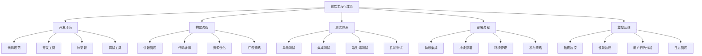

# 前端工程化最佳实践与总结（一）- 工程化基础与架构设计

## 前端工程化概述

### 什么是前端工程化

前端工程化是指运用工程化方法和工具来规范前端开发流程、提高开发效率、保证代码质量和项目可维护性的综合性解决方案。它涵盖了从项目初始化到开发、测试、构建、部署、维护的整个生命周期。

### 前端工程化的核心价值

1. **提高开发效率**：通过自动化工具和标准化流程减少重复工作
2. **保证代码质量**：通过代码规范、测试和审查机制
3. **增强可维护性**：通过模块化、组件化和文档化
4. **优化性能**：通过构建优化和资源管理
5. **提升团队协作**：通过统一的标准和工具链

### 前端工程化体系架构



## 项目架构最佳实践

### 项目结构设计

#### 单体应用结构

```
frontend-app/
├── public/                 # 静态资源
│   ├── index.html
│   ├── favicon.ico
│   └── manifest.json
├── src/                    # 源代码
│   ├── assets/             # 静态资源
│   │   ├── images/
│   │   ├── fonts/
│   │   └── styles/
│   ├── components/         # 通用组件
│   │   ├── common/         # 基础组件
│   │   ├── business/       # 业务组件
│   │   └── layout/         # 布局组件
│   ├── pages/              # 页面组件
│   ├── hooks/              # 自定义Hooks
│   ├── services/           # API服务
│   ├── store/              # 状态管理
│   ├── utils/              # 工具函数
│   ├── types/              # TypeScript类型定义
│   ├── constants/          # 常量定义
│   ├── config/             # 配置文件
│   ├── styles/             # 全局样式
│   ├── App.tsx             # 根组件
│   ├── index.tsx           # 入口文件
│   └── setupTests.ts       # 测试配置
├── tests/                  # 测试文件
│   ├── __mocks__/          # Mock文件
│   ├── fixtures/           # 测试数据
│   └── utils/              # 测试工具
├── docs/                   # 文档
├── scripts/                # 构建脚本
├── .env.example            # 环境变量示例
├── .gitignore              # Git忽略文件
├── package.json            # 项目依赖
├── tsconfig.json           # TypeScript配置
├── webpack.config.js       # Webpack配置
├── jest.config.js          # Jest测试配置
└── README.md               # 项目说明
```

#### 微前端应用结构

```
micro-frontend-app/
├── main-app/               # 主应用
│   ├── public/
│   ├── src/
│   │   ├── components/
│   │   ├── pages/
│   │   ├── micro-apps/     # 微应用注册
│   │   └── utils/
│   ├── package.json
│   └── webpack.config.js
├── micro-apps/             # 微应用
│   ├── user-center/        # 用户中心微应用
│   │   ├── public/
│   │   ├── src/
│   │   ├── package.json
│   │   └── webpack.config.js
│   ├── product-catalog/    # 产品目录微应用
│   │   ├── public/
│   │   ├── src/
│   │   ├── package.json
│   │   └── webpack.config.js
│   └── shopping-cart/      # 购物车微应用
│       ├── public/
│       ├── src/
│       ├── package.json
│       └── webpack.config.js
├── shared/                 # 共享资源
│   ├── components/         # 共享组件
│   ├── utils/              # 共享工具
│   ├── types/              # 共享类型
│   └── styles/             # 共享样式
├── build-tools/            # 构建工具
│   ├── webpack.base.js     # 基础Webpack配置
│   ├── webpack.dev.js      # 开发环境配置
│   └── webpack.prod.js     # 生产环境配置
└── package.json            # 根package.json
```

### 模块化设计原则

#### 单一职责原则

每个模块应该只有一个改变的理由，专注于单一功能。

```javascript
// 好的示例 - 单一职责
class UserService {
  async getUser(id) {
    // 只负责获取用户信息
    return await api.get(`/users/${id}`);
  }
}

class UserValidator {
  validate(user) {
    // 只负责验证用户数据
    return user.email && user.name;
  }
}

// 不好的示例 - 多重职责
class UserManager {
  async getUser(id) {
    // 获取用户信息
    return await api.get(`/users/${id}`);
  }
  
  validate(user) {
    // 验证用户数据
    return user.email && user.name;
  }
  
  save(user) {
    // 保存用户数据
    return api.post('/users', user);
  }
  
  sendEmail(user, message) {
    // 发送邮件
    return emailService.send(user.email, message);
  }
}
```

#### 开放封闭原则

软件实体应该对扩展开放，对修改封闭。

```javascript
// 好的示例 - 开放封闭
class PaymentProcessor {
  constructor(paymentMethods) {
    this.paymentMethods = paymentMethods;
  }
  
  process(paymentMethod, amount) {
    const method = this.paymentMethods.find(m => m.name === paymentMethod);
    if (!method) {
      throw new Error(`Payment method ${paymentMethod} not supported`);
    }
    return method.process(amount);
  }
}

// 扩展新的支付方式，无需修改原有代码
const paymentMethods = [
  {
    name: 'credit-card',
    process: (amount) => processCreditCard(amount)
  },
  {
    name: 'paypal',
    process: (amount) => processPayPal(amount)
  },
  {
    name: 'alipay', // 新增支付方式
    process: (amount) => processAlipay(amount)
  }
];

const paymentProcessor = new PaymentProcessor(paymentMethods);
paymentProcessor.process('alipay', 100);
```

#### 依赖倒置原则

高层模块不应该依赖于低层模块，两者都应该依赖于抽象。

```javascript
// 不好的示例 - 依赖具体实现
class OrderService {
  constructor() {
    this.database = new MySQLDatabase(); // 依赖具体实现
  }
  
  async saveOrder(order) {
    return await this.database.save('orders', order);
  }
}

// 好的示例 - 依赖抽象
class OrderService {
  constructor(database) { // 依赖抽象
    this.database = database;
  }
  
  async saveOrder(order) {
    return await this.database.save('orders', order);
  }
}

// 抽象接口
class DatabaseInterface {
  async save(table, data) {
    throw new Error('Method must be implemented');
  }
}

// 具体实现
class MySQLDatabase extends DatabaseInterface {
  async save(table, data) {
    // MySQL实现
  }
}

class MongoDB extends DatabaseInterface {
  async save(table, data) {
    // MongoDB实现
  }
}

// 使用依赖注入
const orderService = new OrderService(new MySQLDatabase());
```

## 开发流程最佳实践

### 代码规范与风格指南

#### JavaScript/TypeScript规范

```javascript
// .eslintrc.js
module.exports = {
  extends: [
    'eslint:recommended',
    '@typescript-eslint/recommended',
    'prettier'
  ],
  parser: '@typescript-eslint/parser',
  plugins: ['@typescript-eslint'],
  rules: {
    // 命名规范
    '@typescript-eslint/naming-convention': [
      'error',
      {
        selector: 'variable',
        format: ['camelCase', 'UPPER_CASE']
      },
      {
        selector: 'function',
        format: ['camelCase']
      },
      {
        selector: 'typeLike',
        format: ['PascalCase']
      }
    ],
    
    // 代码风格
    'quotes': ['error', 'single'],
    'semi': ['error', 'always'],
    'comma-dangle': ['error', 'never'],
    'no-trailing-spaces': 'error',
    'indent': ['error', 2],
    
    // 最佳实践
    'no-unused-vars': 'error',
    'no-console': 'warn',
    'prefer-const': 'error',
    'no-var': 'error'
  }
};
```

#### CSS规范

```css
/* 使用BEM命名规范 */
.block {
  display: block;
}

.block__element {
  margin: 10px;
}

.block--modifier {
  background-color: #f5f5f5;
}

/* 使用CSS变量 */
:root {
  --primary-color: #1890ff;
  --secondary-color: #52c41a;
  --text-color: #333333;
  --border-radius: 4px;
  --box-shadow: 0 2px 8px rgba(0, 0, 0, 0.15);
}

/* 使用逻辑属性 */
.card {
  padding: var(--spacing-md);
  margin-inline: auto;
  border-radius: var(--border-radius);
  box-shadow: var(--box-shadow);
}

/* 使用现代布局 */
.grid {
  display: grid;
  grid-template-columns: repeat(auto-fit, minmax(300px, 1fr));
  gap: var(--spacing-md);
}

/* 使用容器查询 */
@container (min-width: 768px) {
  .card {
    grid-column: span 2;
  }
}
```

### 组件设计最佳实践

#### 组件设计原则

1. **单一职责**：每个组件只负责一个功能
2. **可复用性**：设计通用、可配置的组件
3. **可组合性**：组件可以组合成更复杂的组件
4. **可测试性**：组件易于测试
5. **性能优化**：避免不必要的渲染

#### 组件示例

```typescript
// Button组件 - 高度可配置
interface ButtonProps {
  variant?: 'primary' | 'secondary' | 'danger' | 'ghost';
  size?: 'small' | 'medium' | 'large';
  disabled?: boolean;
  loading?: boolean;
  icon?: React.ReactNode;
  iconPosition?: 'left' | 'right';
  fullWidth?: boolean;
  className?: string;
  children: React.ReactNode;
  onClick?: (event: React.MouseEvent<HTMLButtonElement>) => void;
}

const Button: React.FC<ButtonProps> = ({
  variant = 'primary',
  size = 'medium',
  disabled = false,
  loading = false,
  icon,
  iconPosition = 'left',
  fullWidth = false,
  className = '',
  children,
  onClick
}) => {
  const baseClass = 'btn';
  const variantClass = `btn--${variant}`;
  const sizeClass = `btn--${size}`;
  const widthClass = fullWidth ? 'btn--full-width' : '';
  const classes = [baseClass, variantClass, sizeClass, widthClass, className]
    .filter(Boolean)
    .join(' ');

  return (
    <button
      className={classes}
      disabled={disabled || loading}
      onClick={onClick}
      type="button"
    >
      {loading && <span className="btn__spinner" />}
      {icon && iconPosition === 'left' && (
        <span className="btn__icon btn__icon--left">{icon}</span>
      )}
      <span className="btn__content">{children}</span>
      {icon && iconPosition === 'right' && (
        <span className="btn__icon btn__icon--right">{icon}</span>
      )}
    </button>
  );
};

export default Button;
```

```css
/* Button组件样式 */
.btn {
  display: inline-flex;
  align-items: center;
  justify-content: center;
  border: none;
  border-radius: var(--border-radius);
  font-weight: 500;
  text-align: center;
  text-decoration: none;
  cursor: pointer;
  transition: all 0.2s ease;
  position: relative;
  overflow: hidden;
}

.btn:focus {
  outline: none;
  box-shadow: 0 0 0 2px rgba(24, 144, 255, 0.2);
}

/* 尺寸变体 */
.btn--small {
  padding: 4px 8px;
  font-size: 12px;
  line-height: 1.5;
}

.btn--medium {
  padding: 8px 16px;
  font-size: 14px;
  line-height: 1.5;
}

.btn--large {
  padding: 12px 24px;
  font-size: 16px;
  line-height: 1.5;
}

/* 颜色变体 */
.btn--primary {
  background-color: var(--primary-color);
  color: white;
}

.btn--primary:hover {
  background-color: #40a9ff;
}

.btn--secondary {
  background-color: transparent;
  color: var(--primary-color);
  border: 1px solid var(--primary-color);
}

.btn--secondary:hover {
  background-color: rgba(24, 144, 255, 0.1);
}

.btn--danger {
  background-color: #ff4d4f;
  color: white;
}

.btn--danger:hover {
  background-color: #ff7875;
}

.btn--ghost {
  background-color: transparent;
  color: var(--text-color);
}

.btn--ghost:hover {
  background-color: rgba(0, 0, 0, 0.05);
}

/* 状态 */
.btn:disabled {
  opacity: 0.6;
  cursor: not-allowed;
}

.btn--full-width {
  width: 100%;
}

/* 图标 */
.btn__icon {
  display: flex;
  align-items: center;
}

.btn__icon--left {
  margin-right: 8px;
}

.btn__icon--right {
  margin-left: 8px;
}

/* 加载状态 */
.btn__spinner {
  display: inline-block;
  width: 14px;
  height: 14px;
  margin-right: 8px;
  border: 2px solid rgba(255, 255, 255, 0.3);
  border-radius: 50%;
  border-top-color: white;
  animation: spin 1s ease-in-out infinite;
}

@keyframes spin {
  to { transform: rotate(360deg); }
}
```

#### 自定义Hook设计

```typescript
// useApi Hook - 封装API调用
interface UseApiOptions<T> {
  immediate?: boolean;
  onSuccess?: (data: T) => void;
  onError?: (error: Error) => void;
}

interface UseApiResult<T> {
  data: T | null;
  loading: boolean;
  error: Error | null;
  execute: () => Promise<void>;
  reset: () => void;
}

function useApi<T>(
  apiCall: () => Promise<T>,
  options: UseApiOptions<T> = {}
): UseApiResult<T> {
  const [data, setData] = useState<T | null>(null);
  const [loading, setLoading] = useState(false);
  const [error, setError] = useState<Error | null>(null);
  const { immediate = false, onSuccess, onError } = options;

  const execute = useCallback(async () => {
    try {
      setLoading(true);
      setError(null);
      const result = await apiCall();
      setData(result);
      onSuccess?.(result);
    } catch (err) {
      const error = err instanceof Error ? err : new Error('Unknown error');
      setError(error);
      onError?.(error);
    } finally {
      setLoading(false);
    }
  }, [apiCall, onSuccess, onError]);

  const reset = useCallback(() => {
    setData(null);
    setLoading(false);
    setError(null);
  }, []);

  useEffect(() => {
    if (immediate) {
      execute();
    }
  }, [immediate, execute]);

  return { data, loading, error, execute, reset };
}

// 使用示例
const UserProfile: React.FC = () => {
  const { data: user, loading, error, execute } = useApi(
    () => userService.getCurrentUser(),
    { immediate: true }
  );

  if (loading) return <div>Loading...</div>;
  if (error) return <div>Error: {error.message}</div>;
  if (!user) return null;

  return (
    <div>
      <h1>{user.name}</h1>
      <p>{user.email}</p>
    </div>
  );
};
```

## 总结

前端工程化是现代前端开发的基础，通过合理的架构设计和开发流程，我们可以：

1. **提高开发效率**：通过模块化设计和标准化流程
2. **保证代码质量**：通过代码规范和组件设计原则
3. **增强可维护性**：通过单一职责和开放封闭原则
4. **提升团队协作**：通过统一的设计模式和开发规范

有效的工程化基础应该：
- 设计清晰的项目结构和模块划分
- 遵循SOLID原则进行模块设计
- 建立统一的代码规范和风格指南
- 设计可复用、可组合的组件
- 封装通用逻辑为自定义Hook

通过建立坚实的工程化基础，团队可以更高效地开发、更轻松地维护，并为后续的性能优化和团队协作提供良好支撑。在下一篇文章中，我们将继续探讨性能优化与团队协作的最佳实践。