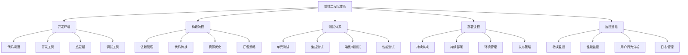

# 前端工程化最佳实践与总结

## 前端工程化概述

### 什么是前端工程化

前端工程化是指运用工程化方法和工具来规范前端开发流程、提高开发效率、保证代码质量和项目可维护性的综合性解决方案。它涵盖了从项目初始化到开发、测试、构建、部署、维护的整个生命周期。

### 前端工程化的核心价值

1. **提高开发效率**：通过自动化工具和标准化流程减少重复工作
2. **保证代码质量**：通过代码规范、测试和审查机制
3. **增强可维护性**：通过模块化、组件化和文档化
4. **优化性能**：通过构建优化和资源管理
5. **提升团队协作**：通过统一的标准和工具链

### 前端工程化体系架构



## 项目架构最佳实践

### 项目结构设计

#### 单体应用结构

```
frontend-app/
├── public/                 # 静态资源
│   ├── index.html
│   ├── favicon.ico
│   └── manifest.json
├── src/                    # 源代码
│   ├── assets/             # 静态资源
│   │   ├── images/
│   │   ├── fonts/
│   │   └── styles/
│   ├── components/         # 通用组件
│   │   ├── common/         # 基础组件
│   │   ├── business/       # 业务组件
│   │   └── layout/         # 布局组件
│   ├── pages/              # 页面组件
│   ├── hooks/              # 自定义Hooks
│   ├── services/           # API服务
│   ├── store/              # 状态管理
│   ├── utils/              # 工具函数
│   ├── types/              # TypeScript类型定义
│   ├── constants/          # 常量定义
│   ├── config/             # 配置文件
│   ├── styles/             # 全局样式
│   ├── App.tsx             # 根组件
│   ├── index.tsx           # 入口文件
│   └── setupTests.ts       # 测试配置
├── tests/                  # 测试文件
│   ├── __mocks__/          # Mock文件
│   ├── fixtures/           # 测试数据
│   └── utils/              # 测试工具
├── docs/                   # 文档
├── scripts/                # 构建脚本
├── .env.example            # 环境变量示例
├── .gitignore              # Git忽略文件
├── package.json            # 项目依赖
├── tsconfig.json           # TypeScript配置
├── webpack.config.js       # Webpack配置
├── jest.config.js          # Jest测试配置
└── README.md               # 项目说明
```

#### 微前端应用结构

```
micro-frontend-app/
├── main-app/               # 主应用
│   ├── public/
│   ├── src/
│   │   ├── components/
│   │   ├── pages/
│   │   ├── micro-apps/     # 微应用注册
│   │   └── utils/
│   ├── package.json
│   └── webpack.config.js
├── micro-apps/             # 微应用
│   ├── user-center/        # 用户中心微应用
│   │   ├── public/
│   │   ├── src/
│   │   ├── package.json
│   │   └── webpack.config.js
│   ├── product-catalog/    # 产品目录微应用
│   │   ├── public/
│   │   ├── src/
│   │   ├── package.json
│   │   └── webpack.config.js
│   └── shopping-cart/      # 购物车微应用
│       ├── public/
│       ├── src/
│       ├── package.json
│       └── webpack.config.js
├── shared/                 # 共享资源
│   ├── components/         # 共享组件
│   ├── utils/              # 共享工具
│   ├── types/              # 共享类型
│   └── styles/             # 共享样式
├── build-tools/            # 构建工具
│   ├── webpack.base.js     # 基础Webpack配置
│   ├── webpack.dev.js      # 开发环境配置
│   └── webpack.prod.js     # 生产环境配置
└── package.json            # 根package.json
```

### 模块化设计原则

#### 单一职责原则

每个模块应该只有一个改变的理由，专注于单一功能。

```javascript
// 好的示例 - 单一职责
class UserService {
  async getUser(id) {
    // 只负责获取用户信息
    return await api.get(`/users/${id}`);
  }
}

class UserValidator {
  validate(user) {
    // 只负责验证用户数据
    return user.email && user.name;
  }
}

// 不好的示例 - 多重职责
class UserManager {
  async getUser(id) {
    // 获取用户信息
    return await api.get(`/users/${id}`);
  }
  
  validate(user) {
    // 验证用户数据
    return user.email && user.name;
  }
  
  save(user) {
    // 保存用户数据
    return api.post('/users', user);
  }
  
  sendEmail(user, message) {
    // 发送邮件
    return emailService.send(user.email, message);
  }
}
```

#### 开放封闭原则

软件实体应该对扩展开放，对修改封闭。

```javascript
// 好的示例 - 开放封闭
class PaymentProcessor {
  constructor(paymentMethods) {
    this.paymentMethods = paymentMethods;
  }
  
  process(paymentMethod, amount) {
    const method = this.paymentMethods.find(m => m.name === paymentMethod);
    if (!method) {
      throw new Error(`Payment method ${paymentMethod} not supported`);
    }
    return method.process(amount);
  }
}

// 扩展新的支付方式，无需修改原有代码
const paymentMethods = [
  {
    name: 'credit-card',
    process: (amount) => processCreditCard(amount)
  },
  {
    name: 'paypal',
    process: (amount) => processPayPal(amount)
  },
  {
    name: 'alipay', // 新增支付方式
    process: (amount) => processAlipay(amount)
  }
];

const paymentProcessor = new PaymentProcessor(paymentMethods);
paymentProcessor.process('alipay', 100);
```

#### 依赖倒置原则

高层模块不应该依赖于低层模块，两者都应该依赖于抽象。

```javascript
// 不好的示例 - 依赖具体实现
class OrderService {
  constructor() {
    this.database = new MySQLDatabase(); // 依赖具体实现
  }
  
  async saveOrder(order) {
    return await this.database.save('orders', order);
  }
}

// 好的示例 - 依赖抽象
class OrderService {
  constructor(database) { // 依赖抽象
    this.database = database;
  }
  
  async saveOrder(order) {
    return await this.database.save('orders', order);
  }
}

// 抽象接口
class DatabaseInterface {
  async save(table, data) {
    throw new Error('Method must be implemented');
  }
}

// 具体实现
class MySQLDatabase extends DatabaseInterface {
  async save(table, data) {
    // MySQL实现
  }
}

class MongoDB extends DatabaseInterface {
  async save(table, data) {
    // MongoDB实现
  }
}

// 使用依赖注入
const orderService = new OrderService(new MySQLDatabase());
```

## 开发流程最佳实践

### 代码规范与风格指南

#### JavaScript/TypeScript规范

```javascript
// .eslintrc.js
module.exports = {
  extends: [
    'eslint:recommended',
    '@typescript-eslint/recommended',
    'prettier'
  ],
  parser: '@typescript-eslint/parser',
  plugins: ['@typescript-eslint'],
  rules: {
    // 命名规范
    '@typescript-eslint/naming-convention': [
      'error',
      {
        selector: 'variable',
        format: ['camelCase', 'UPPER_CASE']
      },
      {
        selector: 'function',
        format: ['camelCase']
      },
      {
        selector: 'typeLike',
        format: ['PascalCase']
      }
    ],
    
    // 代码风格
    'quotes': ['error', 'single'],
    'semi': ['error', 'always'],
    'comma-dangle': ['error', 'never'],
    'no-trailing-spaces': 'error',
    'indent': ['error', 2],
    
    // 最佳实践
    'no-unused-vars': 'error',
    'no-console': 'warn',
    'prefer-const': 'error',
    'no-var': 'error'
  }
};
```

#### CSS规范

```css
/* 使用BEM命名规范 */
.block {
  display: block;
}

.block__element {
  margin: 10px;
}

.block--modifier {
  background-color: #f5f5f5;
}

/* 使用CSS变量 */
:root {
  --primary-color: #1890ff;
  --secondary-color: #52c41a;
  --text-color: #333333;
  --border-radius: 4px;
  --box-shadow: 0 2px 8px rgba(0, 0, 0, 0.15);
}

/* 使用逻辑属性 */
.card {
  padding: var(--spacing-md);
  margin-inline: auto;
  border-radius: var(--border-radius);
  box-shadow: var(--box-shadow);
}

/* 使用现代布局 */
.grid {
  display: grid;
  grid-template-columns: repeat(auto-fit, minmax(300px, 1fr));
  gap: var(--spacing-md);
}

/* 使用容器查询 */
@container (min-width: 768px) {
  .card {
    grid-column: span 2;
  }
}
```

### 组件设计最佳实践

#### 组件设计原则

1. **单一职责**：每个组件只负责一个功能
2. **可复用性**：设计通用、可配置的组件
3. **可组合性**：组件可以组合成更复杂的组件
4. **可测试性**：组件易于测试
5. **性能优化**：避免不必要的渲染

#### 组件示例

```typescript
// Button组件 - 高度可配置
interface ButtonProps {
  variant?: 'primary' | 'secondary' | 'danger' | 'ghost';
  size?: 'small' | 'medium' | 'large';
  disabled?: boolean;
  loading?: boolean;
  icon?: React.ReactNode;
  iconPosition?: 'left' | 'right';
  fullWidth?: boolean;
  className?: string;
  children: React.ReactNode;
  onClick?: (event: React.MouseEvent<HTMLButtonElement>) => void;
}

const Button: React.FC<ButtonProps> = ({
  variant = 'primary',
  size = 'medium',
  disabled = false,
  loading = false,
  icon,
  iconPosition = 'left',
  fullWidth = false,
  className = '',
  children,
  onClick
}) => {
  const baseClass = 'btn';
  const variantClass = `btn--${variant}`;
  const sizeClass = `btn--${size}`;
  const widthClass = fullWidth ? 'btn--full-width' : '';
  const classes = [baseClass, variantClass, sizeClass, widthClass, className]
    .filter(Boolean)
    .join(' ');

  return (
    <button
      className={classes}
      disabled={disabled || loading}
      onClick={onClick}
      type="button"
    >
      {loading && <span className="btn__spinner" />}
      {icon && iconPosition === 'left' && (
        <span className="btn__icon btn__icon--left">{icon}</span>
      )}
      <span className="btn__content">{children}</span>
      {icon && iconPosition === 'right' && (
        <span className="btn__icon btn__icon--right">{icon}</span>
      )}
    </button>
  );
};

export default Button;
```

```css
/* Button组件样式 */
.btn {
  display: inline-flex;
  align-items: center;
  justify-content: center;
  border: none;
  border-radius: var(--border-radius);
  font-weight: 500;
  text-align: center;
  text-decoration: none;
  cursor: pointer;
  transition: all 0.2s ease;
  position: relative;
  overflow: hidden;
}

.btn:focus {
  outline: none;
  box-shadow: 0 0 0 2px rgba(24, 144, 255, 0.2);
}

/* 尺寸变体 */
.btn--small {
  padding: 4px 8px;
  font-size: 12px;
  line-height: 1.5;
}

.btn--medium {
  padding: 8px 16px;
  font-size: 14px;
  line-height: 1.5;
}

.btn--large {
  padding: 12px 24px;
  font-size: 16px;
  line-height: 1.5;
}

/* 颜色变体 */
.btn--primary {
  background-color: var(--primary-color);
  color: white;
}

.btn--primary:hover {
  background-color: #40a9ff;
}

.btn--secondary {
  background-color: transparent;
  color: var(--primary-color);
  border: 1px solid var(--primary-color);
}

.btn--secondary:hover {
  background-color: rgba(24, 144, 255, 0.1);
}

.btn--danger {
  background-color: #ff4d4f;
  color: white;
}

.btn--danger:hover {
  background-color: #ff7875;
}

.btn--ghost {
  background-color: transparent;
  color: var(--text-color);
}

.btn--ghost:hover {
  background-color: rgba(0, 0, 0, 0.05);
}

/* 状态 */
.btn:disabled {
  opacity: 0.6;
  cursor: not-allowed;
}

.btn--full-width {
  width: 100%;
}

/* 图标 */
.btn__icon {
  display: flex;
  align-items: center;
}

.btn__icon--left {
  margin-right: 8px;
}

.btn__icon--right {
  margin-left: 8px;
}

/* 加载状态 */
.btn__spinner {
  display: inline-block;
  width: 14px;
  height: 14px;
  margin-right: 8px;
  border: 2px solid rgba(255, 255, 255, 0.3);
  border-radius: 50%;
  border-top-color: white;
  animation: spin 1s ease-in-out infinite;
}

@keyframes spin {
  to { transform: rotate(360deg); }
}
```

#### 自定义Hook设计

```typescript
// useApi Hook - 封装API调用
interface UseApiOptions<T> {
  immediate?: boolean;
  onSuccess?: (data: T) => void;
  onError?: (error: Error) => void;
}

interface UseApiResult<T> {
  data: T | null;
  loading: boolean;
  error: Error | null;
  execute: () => Promise<void>;
  reset: () => void;
}

function useApi<T>(
  apiCall: () => Promise<T>,
  options: UseApiOptions<T> = {}
): UseApiResult<T> {
  const [data, setData] = useState<T | null>(null);
  const [loading, setLoading] = useState(false);
  const [error, setError] = useState<Error | null>(null);
  const { immediate = false, onSuccess, onError } = options;

  const execute = useCallback(async () => {
    try {
      setLoading(true);
      setError(null);
      const result = await apiCall();
      setData(result);
      onSuccess?.(result);
    } catch (err) {
      const error = err instanceof Error ? err : new Error('Unknown error');
      setError(error);
      onError?.(error);
    } finally {
      setLoading(false);
    }
  }, [apiCall, onSuccess, onError]);

  const reset = useCallback(() => {
    setData(null);
    setLoading(false);
    setError(null);
  }, []);

  useEffect(() => {
    if (immediate) {
      execute();
    }
  }, [immediate, execute]);

  return { data, loading, error, execute, reset };
}

// 使用示例
const UserProfile: React.FC = () => {
  const { data: user, loading, error, execute } = useApi(
    () => userService.getCurrentUser(),
    { immediate: true }
  );

  if (loading) return <div>Loading...</div>;
  if (error) return <div>Error: {error.message}</div>;
  if (!user) return null;

  return (
    <div>
      <h1>{user.name}</h1>
      <p>{user.email}</p>
    </div>
  );
};
```

## 性能优化最佳实践

### 代码分割与懒加载

```typescript
// 路由级别的代码分割
import { lazy, Suspense } from 'react';
import { Routes, Route } from 'react-router-dom';
import LoadingSpinner from './components/LoadingSpinner';

const Home = lazy(() => import('./pages/Home'));
const Products = lazy(() => import('./pages/Products'));
const ProductDetail = lazy(() => import('./pages/ProductDetail'));
const Cart = lazy(() => import('./pages/Cart'));
const Checkout = lazy(() => import('./pages/Checkout'));

const App: React.FC = () => {
  return (
    <Suspense fallback={<LoadingSpinner />}>
      <Routes>
        <Route path="/" element={<Home />} />
        <Route path="/products" element={<Products />} />
        <Route path="/products/:id" element={<ProductDetail />} />
        <Route path="/cart" element={<Cart />} />
        <Route path="/checkout" element={<Checkout />} />
      </Routes>
    </Suspense>
  );
};

// 组件级别的懒加载
const LazyComponent = lazy(() => 
  import('./HeavyComponent').then(module => ({
    default: module.HeavyComponent
  }))
);

// 条件加载
const AdminPanel: React.FC = () => {
  const [isAdmin, setIsAdmin] = useState(false);
  const [AdminComponent, setAdminComponent] = useState<React.ComponentType | null>(null);

  useEffect(() => {
    if (isAdmin) {
      import('./AdminComponent').then(module => {
        setAdminComponent(() => module.default);
      });
    }
  }, [isAdmin]);

  return isAdmin && AdminComponent ? <AdminComponent /> : null;
};
```

### 资源优化

```javascript
// webpack.config.js - 资源优化配置
const path = require('path');
const MiniCssExtractPlugin = require('mini-css-extract-plugin');
const TerserPlugin = require('terser-webpack-plugin');
const CssMinimizerPlugin = require('css-minimizer-webpack-plugin');
const ImageMinimizerPlugin = require('image-minimizer-webpack-plugin');
const CompressionPlugin = require('compression-webpack-plugin');

module.exports = {
  optimization: {
    minimize: true,
    minimizer: [
      new TerserPlugin({
        parallel: true,
        terserOptions: {
          compress: {
            drop_console: true,
            drop_debugger: true,
            pure_funcs: ['console.log']
          }
        }
      }),
      new CssMinimizerPlugin()
    ],
    splitChunks: {
      chunks: 'all',
      cacheGroups: {
        vendor: {
          test: /[\\/]node_modules[\\/]/,
          name: 'vendors',
          chunks: 'all',
          priority: 10
        },
        common: {
          name: 'common',
          minChunks: 2,
          chunks: 'all',
          priority: 5,
          reuseExistingChunk: true
        }
      }
    }
  },
  module: {
    rules: [
      {
        test: /\.(png|jpe?g|gif|svg|webp)$/i,
        type: 'asset',
        parser: {
          dataUrlCondition: {
            maxSize: 8 * 1024 // 8KB
          }
        },
        generator: {
          filename: 'images/[name].[hash][ext]'
        }
      },
      {
        test: /\.(woff|woff2|eot|ttf|otf)$/i,
        type: 'asset/resource',
        generator: {
          filename: 'fonts/[name].[hash][ext]'
        }
      }
    ]
  },
  plugins: [
    new MiniCssExtractPlugin({
      filename: 'styles/[name].[contenthash].css',
      chunkFilename: 'styles/[id].[contenthash].css'
    }),
    new ImageMinimizerPlugin({
      minimizer: {
        implementation: ImageMinimizerPlugin.imageminMinify,
        options: {
          plugins: [
            ['gifsicle', { optimizationLevel: 7 }],
            ['mozjpeg', { quality: 80 }],
            ['pngquant', { quality: [0.65, 0.8] }],
            ['svgo', { plugins: [{ name: 'removeViewBox', active: false }] }]
          ]
        }
      }
    }),
    new CompressionPlugin({
      algorithm: 'gzip',
      test: /\.(js|css|html|svg)$/,
      threshold: 10240,
      minRatio: 0.8
    })
  ]
};
```

### 渲染优化

```typescript
// 使用React.memo优化组件渲染
const ProductCard = React.memo(({ product, onAddToCart }: ProductCardProps) => {
  return (
    <div className="product-card">
      
      <h3>{product.name}</h3>
      <p>{product.price}</p>
      <button onClick={() => onAddToCart(product.id)}>
        Add to Cart
      </button>
    </div>
  );
}, (prevProps, nextProps) => {
  // 自定义比较函数
  return (
    prevProps.product.id === nextProps.product.id &&
    prevProps.product.price === nextProps.product.price &&
    prevProps.onAddToCart === nextProps.onAddToCart
  );
});

// 使用useMemo缓存计算结果
const ProductList: React.FC<{ products: Product[] }> = ({ products }) => {
  const expensiveValue = useMemo(() => {
    return products.reduce((sum, product) => sum + product.price, 0);
  }, [products]);

  return (
    <div>
      <h2>Total Price: ${expensiveValue}</h2>
      {products.map(product => (
        <ProductCard key={product.id} product={product} />
      ))}
    </div>
  );
};

// 使用useCallback缓存函数
const ProductContainer: React.FC = () => {
  const [products, setProducts] = useState<Product[]>([]);
  
  const handleAddToCart = useCallback((productId: string) => {
    // 添加到购物车逻辑
    console.log(`Added product ${productId} to cart`);
  }, []);

  return (
    <div>
      {products.map(product => (
        <ProductCard
          key={product.id}
          product={product}
          onAddToCart={handleAddToCart}
        />
      ))}
    </div>
  );
};

// 虚拟滚动优化长列表
import { FixedSizeList as List } from 'react-window';

const VirtualizedProductList: React.FC<{ products: Product[] }> = ({ products }) => {
  const Row = ({ index, style }: { index: number; style: React.CSSProperties }) => (
    <div style={style}>
      <ProductCard product={products[index]} />
    </div>
  );

  return (
    <List
      height={600}
      itemCount={products.length}
      itemSize={200}
      width="100%"
    >
      {Row}
    </List>
  );
};
```

## 测试最佳实践

### 测试策略

```typescript
// 单元测试示例
import { render, screen, fireEvent, waitFor } from '@testing-library/react';
import userEvent from '@testing-library/user-event';
import { Provider } from 'react-redux';
import { configureStore } from '@reduxjs/toolkit';
import ProductCard from './ProductCard';
import cartReducer from '../store/cartSlice';

// 创建测试store
const createTestStore = (initialState = {}) => {
  return configureStore({
    reducer: {
      cart: cartReducer
    },
    preloadedState: initialState
  });
};

// 测试工具函数
const renderWithProviders = (
  ui: React.ReactElement,
  { initialState = {}, store = createTestStore(initialState) } = {}
) => {
  const Wrapper = ({ children }: { children: React.ReactNode }) => (
    <Provider store={store}>{children}</Provider>
  );

  return { store, ...render(ui, { wrapper: Wrapper }) };
};

describe('ProductCard', () => {
  const mockProduct = {
    id: '1',
    name: 'Test Product',
    price: 99.99,
    image: 'test-image.jpg'
  };

  it('renders product information correctly', () => {
    renderWithProviders(<ProductCard product={mockProduct} />);
    
    expect(screen.getByText('Test Product')).toBeInTheDocument();
    expect(screen.getByText('$99.99')).toBeInTheDocument();
    expect(screen.getByAltText('Test Product')).toBeInTheDocument();
  });

  it('calls onAddToCart when button is clicked', async () => {
    const mockOnAddToCart = jest.fn();
    renderWithProviders(
      <ProductCard product={mockProduct} onAddToCart={mockOnAddToCart} />
    );
    
    const addToCartButton = screen.getByRole('button', { name: /add to cart/i });
    await userEvent.click(addToCartButton);
    
    expect(mockOnAddToCart).toHaveBeenCalledWith(mockProduct.id);
  });

  it('shows loading state when adding to cart', async () => {
    const mockOnAddToCart = jest.fn(() => new Promise(resolve => setTimeout(resolve, 1000)));
    renderWithProviders(
      <ProductCard product={mockProduct} onAddToCart={mockOnAddToCart} />
    );
    
    const addToCartButton = screen.getByRole('button', { name: /add to cart/i });
    await userEvent.click(addToCartButton);
    
    expect(screen.getByText('Adding...')).toBeInTheDocument();
    
    await waitFor(() => {
      expect(screen.queryByText('Adding...')).not.toBeInTheDocument();
    });
  });
});
```

### 集成测试

```typescript
// 集成测试示例
import { render, screen, waitFor } from '@testing-library/react';
import { BrowserRouter } from 'react-router-dom';
import { Provider } from 'react-redux';
import { configureStore } from '@reduxjs/toolkit';
import App from '../App';
import productsReducer from '../store/productsSlice';
import cartReducer from '../store/cartSlice';

// Mock API
jest.mock('../services/api', () => ({
  getProducts: jest.fn(() => Promise.resolve([
    { id: '1', name: 'Product 1', price: 10 },
    { id: '2', name: 'Product 2', price: 20 }
  ]))
}));

const createTestStore = () => {
  return configureStore({
    reducer: {
      products: productsReducer,
      cart: cartReducer
    }
  });
};

const renderApp = () => {
  const store = createTestStore();
  return render(
    <Provider store={store}>
      <BrowserRouter>
        <App />
      </BrowserRouter>
    </Provider>
  );
};

describe('Shopping Flow Integration', () => {
  it('allows user to browse products and add to cart', async () => {
    renderApp();
    
    // 等待产品加载
    await waitFor(() => {
      expect(screen.getByText('Product 1')).toBeInTheDocument();
      expect(screen.getByText('Product 2')).toBeInTheDocument();
    });
    
    // 添加产品到购物车
    const addToCartButtons = screen.getAllByText('Add to Cart');
    await userEvent.click(addToCartButtons[0]);
    
    // 检查购物车数量
    expect(screen.getByText('Cart (1)')).toBeInTheDocument();
    
    // 导航到购物车页面
    const cartLink = screen.getByText('Cart');
    await userEvent.click(cartLink);
    
    // 验证购物车内容
    await waitFor(() => {
      expect(screen.getByText('Product 1')).toBeInTheDocument();
      expect(screen.getByText('$10')).toBeInTheDocument();
    });
  });
});
```

### 端到端测试

```typescript
// Cypress端到端测试示例
describe('E-commerce E2E Tests', () => {
  beforeEach(() => {
    cy.visit('/');
  });

  it('should display products on homepage', () => {
    cy.get('[data-testid="product-list"]').should('be.visible');
    cy.get('[data-testid="product-card"]').should('have.length.greaterThan', 0);
  });

  it('should allow user to add product to cart', () => {
    cy.get('[data-testid="product-card"]').first().within(() => {
      cy.get('[data-testid="product-name"]').invoke('text').as('productName');
      cy.get('[data-testid="add-to-cart-btn"]').click();
    });
    
    cy.get('[data-testid="cart-badge"]').should('contain', '1');
    
    cy.get('[data-testid="cart-link"]').click();
    
    cy.get('@productName').then(productName => {
      cy.get('[data-testid="cart-item"]').should('contain', productName);
    });
  });

  it('should allow user to complete checkout', () => {
    // 添加产品到购物车
    cy.get('[data-testid="product-card"]').first().within(() => {
      cy.get('[data-testid="add-to-cart-btn"]').click();
    });
    
    // 导航到购物车
    cy.get('[data-testid="cart-link"]').click();
    
    // 点击结账按钮
    cy.get('[data-testid="checkout-btn"]').click();
    
    // 填写结账表单
    cy.get('[data-testid="email-input"]').type('test@example.com');
    cy.get('[data-testid="name-input"]').type('Test User');
    cy.get('[data-testid="address-input"]').type('123 Test St');
    cy.get('[data-testid="city-input"]').type('Test City');
    cy.get('[data-testid="zip-input"]').type('12345');
    
    // 提交订单
    cy.get('[data-testid="place-order-btn"]').click();
    
    // 验证订单确认页面
    cy.get('[data-testid="order-confirmation"]').should('be.visible');
    cy.get('[data-testid="order-number"]').should('not.be.empty');
  });
});
```

## 团队协作最佳实践

### Git工作流

```bash
# 功能分支工作流
git checkout -b feature/user-authentication
# 开发功能...
git add .
git commit -m "feat: implement user authentication"
git push origin feature/user-authentication
# 创建Pull Request

# 提交信息规范
feat: 新功能
fix: 修复bug
docs: 文档更新
style: 代码格式调整
refactor: 代码重构
test: 测试相关
chore: 构建过程或辅助工具的变动

# 示例
feat(auth): add user login functionality
fix(cart): resolve calculation error in total price
docs(readme): update installation instructions
```

### 代码审查

#### Pull Request模板

```markdown
## 变更描述
简要描述此PR的目的和变更内容。

## 变更类型
- [ ] 新功能
- [ ] Bug修复
- [ ] 重构
- [ ] 文档更新
- [ ] 性能优化
- [ ] 其他

## 测试
- [ ] 单元测试已通过
- [ ] 集成测试已通过
- [ ] 手动测试已完成
- [ ] 浏览器兼容性测试已完成

## 检查清单
- [ ] 代码遵循项目编码规范
- [ ] 已添加必要的注释
- [ ] 已更新相关文档
- [ ] 无console.log或debugger语句
- [ ] 无硬编码的配置值

## 相关Issue
Closes #123

## 截图（如适用）
如果是UI变更，请提供前后对比截图。

## 其他说明
任何审查者需要知道的额外信息。
```

#### 代码审查指南

1. **审查重点**：
   - 代码逻辑和实现
   - 性能影响
   - 安全问题
   - 可维护性
   - 测试覆盖率

2. **审查技巧**：
   - 提供建设性反馈
   - 解释问题原因
   - 提出改进建议
   - 保持礼貌和尊重

3. **审查流程**：
   - 自动化检查通过
   - 至少一人审查
   - 所有反馈已解决
   - 合并到主分支

### 文档管理

#### README模板

```markdown
# 项目名称

简短描述项目的目的和功能。

## 技术栈

- React 18
- TypeScript
- Redux Toolkit
- Material-UI
- Webpack 5
- Jest
- Cypress

## 开发环境设置

### 前置要求

- Node.js >= 16.0.0
- npm >= 8.0.0

### 安装依赖

```bash
npm install
```

### 开发服务器

```bash
npm run dev
```

### 构建生产版本

```bash
npm run build
```

### 运行测试

```bash
# 单元测试
npm run test

# 端到端测试
npm run test:e2e

# 测试覆盖率
npm run test:coverage
```

## 项目结构

简要说明项目目录结构和各部分的作用。

## 部署

说明如何部署项目到不同环境。

## 贡献指南

说明如何为项目贡献代码。

## 许可证

MIT License
```

#### API文档

```typescript
/**
 * 获取用户信息
 * @param userId 用户ID
 * @returns 用户信息对象
 * @throws {Error} 当用户不存在时抛出错误
 * @example
 * ```typescript
 * try {
 *   const user = await getUser('123');
 *   console.log(user.name);
 * } catch (error) {
 *   console.error(error.message);
 * }
 * ```
 */
export const getUser = async (userId: string): Promise<User> => {
  const response = await fetch(`/api/users/${userId}`);
  
  if (!response.ok) {
    throw new Error('User not found');
  }
  
  return response.json();
};
```

## 总结

前端工程化是一个综合性的解决方案，它涵盖了从项目架构到开发流程、从性能优化到团队协作的各个方面。通过实施最佳实践，我们可以：

1. **提高开发效率**：通过自动化工具和标准化流程
2. **保证代码质量**：通过代码规范、测试和审查机制
3. **增强可维护性**：通过模块化、组件化和文档化
4. **优化性能**：通过构建优化和资源管理
5. **提升团队协作**：通过统一的标准和工具链

有效的工程化实践应该：
- 根据项目规模和团队情况选择合适的工具和流程
- 持续优化和改进工程化体系
- 重视文档和知识分享
- 培养团队的工程化意识

前端工程化不是一蹴而就的，而是一个持续演进的过程。随着技术的发展和项目需求的变化，我们需要不断调整和优化工程化方案，以适应新的挑战和机遇。通过建立完善的工程化体系，我们可以为前端开发提供坚实的基础，支撑业务的快速发展和创新。